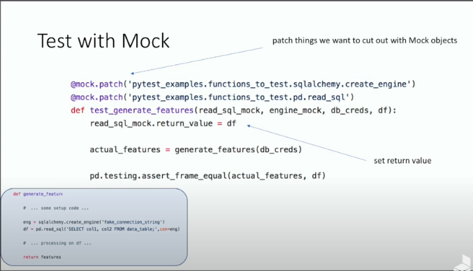

# My-Helper-Functions
This repository is containing functions that I use in Python a lot.

# Important Python Concepts in OOP

1) Classes allow us to group data and functions and make them easy to use. We don't have to use `self` in regular methods(like constructor) but using `self` is a convention. In class methods, `cls` is a convention. Class variables are variables that were shared by all instances of Class and they are the same across all instances. If we want class variables to be modified through instances, use them via self. However, if you don't want class variables to be modified through instances, use them via Employee.class_variable or define a **classmethod**(set_raise_amt) that modifies class variable. **from_string** is an alternative method defined via **classmethod**. staticmethod neither takes an cls argument like classmethod nor self argument like regular method. It is in class because of some kind of relationship with Class. In reality, staticmethod shouldn't access to a class or an instance anywhere in itself.

```classes_intro.py
import datetime

class Employee:
    #raise_amount is a class variable
    raise_amt = 1.04
    num_of_emps = 0

    def __init__(self,first,last,pay):
        #first,last,pay are instance variables.
        self.first = first
        self.last = last
        self.pay = pay
        self.email = self.first + '.' + self.last + '@mycompany.com'
        Employee.num_of_emps += 1

    def fullname(self):
        return f'{self.first} {self.last}'

    def apply_raise(self):
        self.pay = int(self.pay * self.raise_amt)

    def __repr__(self):
        return "Employee( {} {} {} )".format(self.first,self.last,self.pay)

    def __str__(self):
        return '{} - {}'.format(self.fullname(),self.email)

    def __add__(self,other):
        return self.pay + other.pay

    def __len__(self):
        return len(self.fullname())

    @classmethod
    def set_raise_amt(cls,amount):
        cls.raise_amt = amount

    # An alternative constructor via classmethod
    @classmethod
    def from_string(cls,emp_str):
        first, last, pay = emp_str.split('-')
        return cls(first,last,pay)

    @staticmethod
    def is_workday(day):
        if (day.weekday() == 5) | (day.weekday() == 6):
            return False
        return True

# Setting instances
emp_1 = Employee('Muhammed','Buyukkinaci',100)
emp_2 = Employee('lorem','ipsum',50)
print(emp_1 + emp_2)# 150 = 100 + 50; sums pays of 2 objects thanks to dunder add method
print(repr(emp_1))#Employee( Muhammed Buyukkinaci 100 )
print(str(emp_1))#Muhammed Buyukkinaci - Muhammed.Buyukkinaci@mycompany.com
print(len(emp_1))#20
print(emp_1.email)# Muhammed.Buyukkinaci@mycompany.com
print(emp_1.fullname())#Muhammed Buyukkinaci
# Raising pay
emp_1.apply_raise()
print(emp_1.pay)#104
# Changing raise_amount class variable and applying this change
Employee.raise_amt = 1.5
emp_1.apply_raise()
print(emp_1.pay)#156
print(emp_2.pay)#50
emp_2.apply_raise()
print(emp_2.pay)#75
# Setting raise_amt class variable to 1.05
Employee.set_raise_amt(1.05)
# Applying this change to existing instance
emp_2.apply_raise()
print(emp_2.pay)#75*1.05 = 78
# An alternative constructor to default constructor
emp_3 = Employee.from_string('Ali-Yilmaz-200')
print(emp_3.first)
# staticmethod
my_date = datetime.date(2016,1,1)
print(Employee.is_workday(my_date))# True

class Developer(Employee):
    raise_amt = 1.1
    def __init__(self,first,last,pay,prog_lang):
        super().__init__(first,last,pay)
        self.prog_lang = prog_lang

class Manager(Employee):
    def __init__(self,first,last,pay,employees=None):
        super().__init__(first,last,pay)
        if employees is None:
            self.employees = []
        else:
            self.employees = employees
    
    def add_emp(self,emp):
        if emp not in self.employees:
            self.employees.append(emp)
    
    def add_emp(self,emp):
        if emp in self.employees:
            self.employees.remove(emp)
    
    def print_emps(self):
        for emp in self.employees:
            print("--->",emp.fullname())


dev_1 = Developer('Ahmet','Yilmaz',120,'Python')
dev_1.apply_raise()
print(dev_1.pay)# 120*1.1 = 132
print(dev_1.prog_lang)#Python

man_1 = Manager('Hasan','Yilmaz',150,[dev_1])
print(man_1.email)#Hasan.Yilmaz@mycompany.com

man_1.print_emps()#---> Ahmet Yilmaz

print(isinstance(man_1,Manager))# True
print(isinstance(man_1,Employee))# True
print(isinstance(man_1,Developer))# False

print(issubclass(Developer,Employee))# True
print(issubclass(Manager,Employee))# True
print(issubclass(Developer,Manager))# False

```

2) Some terms about OOP:

- Inheritance: Using methods and attributes of a parent Class in Child Clas. `super` keyword is used to inherit from a class. Don't call super() in the middle of a constructor method. Run it either at the beginning or at the end.

- Encapsulation: Accessing the attribute of a Class only in itself(private) by defining the attributes starting with double underscore __. It isn't accessible from instances of that Class. Single underscore _ used for defining protected attributes in a class. Protected means accesible with the Class and its subclasses but expected not to be accessible from instances of objects. However, protected variables are accessible from instances though. No underscore for public attributes. Encapsulation isn't only for attributes. Encapsulation may be implemented for methods too. If we want to see method resolution order or a sub class, run `print(help(Developer)). Every class in Python inherits from builtins.object class. Change in child class doesn't affect parent class. Python's Dataclasses don't support encapsulation.

```ensapsulation.py

class Temp:
    def __init__(self,public, protected, private):
        self.public = public
        self._protected = protected
        self.__private = private

temp = Temp(public=1,protected=2, private=3)
print(temp.public)#1
print(temp._protected)#2
print(temp._Temp__private)#3
print(temp.__private)# AttributeError


```

- Polymorphism: Being able to send different inputs to a method or a function like Python's built-in len function.

- Method Overriding: Rewriting a method inherited from a parent class in the Child class.

- Method Overloading: Calling same method with different number of parameters like we did in C#. Two methods can't have the same name in Python. Not possible in Python by default. However, some ways in this document are existent.

- A method in a class may return only `self`, which means itself.

- Information Hiding: It is about hiding information from different components of the program in order to be flexible. It is related to Encapsulation.

- It is not recommended to use multiple inheritance and mixins. THey are problematic in terms of cohesion and coupling.

- Some guides on classes:
    - Keep classes small
    - Consider classes either data focused or behavior focused
    - Encourage using property if posbbile rather than a method.
    - lru_cache, cached_property usage
    - dependency injection
    - make sure class is needed.

3) Double underscores is called as dunder. \__init__ is a special method. \__repr__ and \__str__. These 2 special methods allow us to change how our objects are printed and displayed. len is a special method too, which runs a dunder method named \__len__ .

```
print(1+2)#
print(int.__add__(1,2))#3
print(str.__add__('a','b')) # 'ab'
print(len('test'))#4
print('test'.__len__())
```

4) The goal of repr is to be unambiguous. The goal of str is to be readable. repr is mostly used in debugging.


5)  What does `if __name__ == '__main__'` mean? Whenever Python runs a file, it first goes through before even runs any code, it sets a few special variables. \__name__ is one of these special variables. `if __name__ == '__main__'` checks whether a file in being run directly or imported from a different module. It returns True if directly run from script and returns False if it called from another script. The reason why we use our codes in main function in first_module.py is to make it importable in another script. If we don't put our codes in a main function, our global scope will be polluted.


```first_module.py
#first_module.py

print("This will always be run")

def main():
    print("First module's name: {}".format(__name__))

if __name__ == '__main__':
    print("Runs directly")
    main()
else:
    print("Run from import")

```

```second_module.py
import first_module
print("Second module's name: {}".format(__name__))
```


6) property usage in Python classes. property is making a method as an attribute of a Class. It is a decorator. peperty decorator allows us to define method but we can access it like an attribute. Properties shoul be cheap, simple and unsurprising, which means it shouldn't make complex computations.

```property_usage.py
# Property Decorator
class Personnel:
    def __init__(self,first,last,pay):
        #first,last,pay are instance variables.
        self.first = first
        self.last = last
        self.email = self.first + '.' + self.last + '@mycompany.com'
    def fullname(self):
        return f'{self.first} {self.last}'

per_1 = Employee('John','Smith',100)
per_1.first = 'Jim'
print(per_1.first)#Jim
print(per_1.email)#John.Smith@mycompany.com
print(per_1.fullname())#Jim Smith

class Worker:
    def __init__(self,first,last,pay):
        #first,last,pay are instance variables.
        self.first = first
        self.last = last

    @property
    def email(self):
        return self.first + '.' + self.last + '@mycompany.com'

    @property
    def fullname(self):
        return f'{self.first} {self.last}'

    @fullname.setter
    def fullname(self,name):
        first,last = name.split(' ')
        self.first = first
        self.last = last

    @fullname.deleter
    def fullname(self):
        print("delete name !")
        self.first = None
        self.last = None

wor_1 = Worker('John','Smith',100)
wor_1.first = 'Jim'
print(wor_1.first)#Jim
print(wor_1.email)#Jim.Smith@mycompany.com
print(wor_1.fullname)#Jim Smith

wor_1.fullname = "Muhammed Büyükkınacı"
print(wor_1.first)#Muhammed
print(wor_1.email)#Muhammed.Büyükkınacı@mycompany.com
print(wor_1.fullname)#Muhammed Büyükkınacı

del wor_1.fullname# delete name !
```


7) self is a conventional name in Python classes, not a magical keyword. It could be s or me or whatever we name. 

8) To check if a variable has a numeric type of Float, integer, Decimal etc; use isinstance. If you want check whether a class is a subclass of another class, use `issubclass`

```filename.py
import numbers
isinstance(variable_name,numbers.Number)
```

```is_subclass.py
class A:
    pass

class B(A):
    pass

print(issubclass(B,A))# True, B is a sub class of A.

```

9) Always try to make code DRY(don't repeat yourself)

10) String interpolations should be used instead of string concatenation. String interpolation is less prone to errors. If we are repeating placeholders, we can assign indexes to them. WE can make the same operation like zfill in formatting strings via `:`.

```string_interpolation.py

a = 2
b = 'Muhammed'

# The former one is string concatenation
my_string = 'I am ' + b ' and I have ' + str(b) + 'computers'

# The latter is string interpolation
my_string = 'I am {} and I have {} computers'.format(b,a)

# Use multiple same placeholders via assigning placeholders
my_string = "I am {0} and I am {1} years old. {1} years old is a critical age in human life.".format('Muhammed',28)

# Dict usage in string interpolation
mydict = {'name':'Muhammed','age':28}
my_string = "I am {0[name]} and I am {0[age]} years old. {0[age]} years old is a critical age in human life.".format(mydict)

# List usage in string interpolation
mydict = ['Muhammed',28]
my_string = "I am {0[0]} and I am {0[1]} years old. {0[1]} years old is a critical age in human life.".format(mydict)

# Single or Double quotation for string
temp_string = "Ali'nin arabası var."
print(f"cümle = {temp_string}")#cümle = Ali'nin arabası var.
print(f"cümle = {temp_string!r}")#cümle = "Ali'nin arabası var."

# Variable name and its value
a = 344
print(f"my variable is {a=}")#my variable is a=344
```

11) Idempotency is a programming term meaning that calling something(an HTTP word, python function etc.) once is the same as calling it multiple times. GET, PUT, DELELTE are idempotent HTTP words. POST isn't a idempotent HTTP word.

```idempotent.py
def func_not_idempotent(x):
    return x + 20

# Not idempotent
#func_not_idempotent(func_not_idempotent(10)) != func_not_idempotent(10)

def func_idempotent(x):
    return abs(x)

# Idempotent
func_idempotent(-10) == func_idempotent(func_idempotent(-10)) == func_idempotent(func_idempotent(func_idempotent(-10)))
```

12) namedtuple is more readable. Its is also immutable. It is an alternative to Python dictionaries but less prone to typing errors.

```namedtuple.py
from collections import namedtuple

Color = namedtuple('Color',['red','green','blue'])

white = Color(255,255,255)
black = Color(0,0,0)
gray = Color(red = 128, green = 128, blue = 128)

print(f"red index of white = {white.red} ")
print(f"green index of black = {black.green} ")
print(f"blue index of gray = {gray.blue} ")

```

13) `id` is showing us the location of an object on memory. Assigning a different value to an existing object is creating it from scracth and therefore it is slow.
```python_id.py
a = 'Ozan'
a = 'Ozan'
print(f"{a}; its location on memory = {id(a)}")
a = 'Burak'
print(f"{a}; its location on memory = {id(a)}")
# The last print prompts error.
a[0] = 'D'
print(f"{a}; its location on memory = {id(a)}")
#Ozan; its location on memory = 140241796670896
#Burak; its location on memory = 140241796670832
```

14)  String objects are immutable. However, list is mutable. Preferring mutable objects(list) instead of immutable objects is more logical in concatenating lots of strings because mutable objects aren't creating new objects each time like immutable objects(String etc.) did.

```mutable_vs_immutable.py
a = 'Burak'
print(f"{a}; its location on memory = {id(a)}")
# The below print prompts error.
a[0] = 'D'
print(f"{a}; its location on memory = {id(a)}")

# integer, immutable, different
a = 3
print(id(a))
a = 4
print(id(a))
# List, mutable, same
b = [1,2,3]
print(id(b))
b.append(4)
print(id(b))
#Tuple, immutable, different
c = (1,2,3)
print(id(c))
c = (1,2)
print(id(c))
#dict, mutable, same
d = {'a':1,'b':2}
print(id(d))
d['c'] = 3
print(id(d))
# string, immutable, different
e ='abcde'
print(id(e))
e = 'abcdef'
print(id(e))
# set, mutable, same
f = {1,2,3}
print(id(f))
f.add(4)
print(id(f))
```

15) else statement in loops(for or while) should be considered as no-break. it is executed if for loop runs smoothly.

```for_else.py
a = [1,2,3,4,5]
for i in a:
    print(i)
    if i == 3:
        break
else:
    print("While else print executed at the end because no break happened")
```

```while_else.py
i = 1
while i <= 5:
    print(i)
    i += 1
else:
    print("While else print executed at the end because no break happened")
```

```practical_loop_else.py
def index_finder(passed_list,searched_word):
    for index, i in enumerate(passed_list):
        if searched_word == i:
            break
    else:
        return -1
    return index

print(index_finder(['a','b','c','d','e'],'b'))#prints 1
print(index_finder(['a','b','c','d','e'],'f'))#prints -1
```

16) Python generator don't hold entire results in memory therefore it improves performance. Holding millions of records in a generator is more performant than holding millions of records in list. Generator functions are more readable than generator classes. Generators come inhandy when writing memory efficient programs. A brute force way to check a group of possible characters may be done using generators.

``` python_generator.py

nums_list_comp = [pow(i,3) for i in [3,4,5]]
print(nums_list_comp)
#[27,64,125]

nums_generators_like_list_comp = (pow(i,3) for i in [3,4,5])
print(nums_generators_like_list_comp)
#<generator object <genexpr> at 0x7fa53c98a650>
print(next(nums_generators_like_list_comp))
# 27
print(next(nums_generators_like_list_comp))
# 64
print(next(nums_generators_like_list_comp))
# 125

def legacy_solution(nums):
    return_list = []
    for i in nums:
        return_list.append(pow(i,3))
    return return_list

nums_legacy = legacy_solution([3,4,5])
print(nums_legacy)
#[27,64,125]

def generator_solution(nums):
    for i in nums:
        yield (pow(i,3))

nums_generators = generator_solution([3,4,5])
print(nums_generators)
#<generator object generator_solution at 0x7f9e1c3c2650>
for i in nums_generators:
    print(i)
#27
#64
#125

```

17) map&lambda and filter&lambda functions in python3 are evaluated lazily. Prefer list comprehensions over map&lambda and filter&lambda pairs. asteriks(*) is used to show map or filter. Python list comprehensions are faster in python 3.12 because it reduces the number of function calls. It will call less functions. Calling a function in python is a costly operation which should be avoided if possible.

```prefer_lc.py
nums = [1,2,3]
#Take squares in list comprehensions
print([n**2 for n in nums])#prints: [1, 4, 9]
# Same operation using map and lambda
mapped = map(lambda n: n*n, nums)
print(mapped)#prints: <map object at 0x7f4b6bb5bbb0>
print(*mapped)# prints 1,4,9

filtered = filter(lambda n: n%2==1, nums)
print(filtered)#prints: <map object at 0x7f4b6bb5bbb0>
print(*filtered)# prints 1,3
```

18) Memoization is a programming term meaning caching results of a computationally expensive operation recurring more than once instead of re-computation. The code below runs in 2 seconds thanks to memoization instead of 4 seconds.

```memoization.py
import time
square_dict={}
def take_squares(num):
    if num in square_dict:
        return square_dict[num]
    print(f"Computing results for {num}")
    time.sleep(1)
    result = num * num
    square_dict[num] = result
    return result

result = take_squares(4)
print(result)
result =take_squares(10)
print(result)
result =take_squares(4)
print(result)
result =take_squares(10)
print(result)

```

19) Slicing in list is programmed in the format of `list_name[start:end:step]`. The default step is 1.

```slicing.py
my_list = [0,1,2,3,4,5,6,7,8,9]
print( my_list[2:-1:1] )# prints [2, 4, 6, 8]
#Reverse with respect to start, end and step
print( my_list[-1:-8:-2] )#[9, 7, 5, 3]
# Reverse all list
print(mylist[::-1])
# Reverse the string
my_string = "a string is here"
print(my_string[::-1]) #ereh si gnirts a

```

20) In Python, to list all builtin attributes or exceptions or errors, run `print(dir(locals()['__builtins__']))` .

21) `try`, `except`, `else` and `finally` are keywords in exceptions. THere may be multiple except keyword in error handling. Put the specific exceptions in above excepts and put general ones in below excepts. else runs if try doesn't raise an exception. `finally` is run in every condition. To manually raise an exception, use `raise Exception`. `try` and `finally` can be used without `except` statement. `finally` can be used to clean up the resources.

```exception01.py

# Definin a custom exception
class MyDefinedException(Exception):
    pass

a33 = 20
try:
    a = a33
    file = open('.gitignore')
    if a == a33:
        raise MyDefinedException
except NameError as e:
    print("Name error occured")
    print(e)
except FileNotFoundError as e:
    print("an error occurred")
    print(e)
except MyDefinedException as e:
    print("My defined exception runs")
except Exception as e:
    print("another exception except above ones happened")
    print(e)
else:
    print("no exception happened")
finally:
    print("finally prins run in every condition")

#My defined exception runs
#finally prins run in every condition
```

```exception02.py

a33 = 20
try:
    a = a33
    file = open('.gitignore')
except NameError as e:
    print("Name error occured")
    print(e)
except FileNotFoundError as e:
    print("an error occurred")
    print(e)
except Exception as e:
    print("another exception except above ones happened")
    print(e)
else:
    print("no exception happened")
finally:
    print("finally prins run in every condition")

#no exception happened
#finally prins run in every condition

```

22) Being Pythonic means following conventions and coding styles of Python in order to write clean and readable code. 2 common concepts to become Pythonic:
Duck Typing and Easier to ask forgiveness than permission(EAFP).

23) **Duck Typing** is that the type or the class of an object is less important than the method it defines. Using Duck Typing, we do not check types at all. Duck typing is implemented in Dynamic languages like Python, Perl, JS. Duck typing emphasizes what the object really can do rather than what the object is.

```duck_typing.py
class Duck:
    def fly(self):
        print("Duck is flying")
    def quack(self):
        print("Duck is quacking")
class Bear:
    def fly(self):
        print("Bear is flying")
    def quack(self):
        print("Bear is quacking")
def fly_and_quack(thing):
    if isinstance(thing,Duck):
        thing.fly()
        thing.quack()

def duck_typed_fly_and_quack(thing):
    thing.fly()
    thing.quack()

duck = Duck()
bear = Bear()

print("No duck typing")
fly_and_quack(duck)
fly_and_quack(bear)
# outputs below:
#No duck typing
#Duck is flying
#Duck is quacking
# outputs below:
print("Duck typing")
duck_typed_fly_and_quack(duck)
duck_typed_fly_and_quack(bear)

#Duck typing
#Duck is flying
#Duck is quacking
#Bear is flying
#Bear is quacking

```


24) **LBYL**(Look Before You Leap) and **EAFP**(Easier to ask forgiveness than permission) are 2 terms in Programming. Python is EAFP. LBYL is using lots of if-else statements. EAFP suggests using try/except blocks instead of multiple checks via if-else statements. If your code hass less exceptions, EAFP is faster than LBYL because we access the object once.

```lbyl_vs_eafp.py

person1 = {'name':'Muhammed','age':28, 'job':'Data Scientist'}
person2 = {'name':'Muhammed','age':28}

def lbyl(person):
    # LBYL
    if ('name' in person) and ('age' in person) and ('job' in person):
        print( "I am {}, I am {} years old, I am working as a {} ".format(person['name'],person['age'],person['job']) )
    else:
        print("there are some missing keysin LBYL")

def eafp(person):
    try:
        print( "I am {}, I am {} years old, I am working as a {} ".format(person['name'],person['age'],person['job']) )
    except KeyError as e:
        print("there are some missing keys in EAFP")

lbyl(person1)# I am Muhammed, I am 28 years old, I am working as a Data Scientist 
eafp(person1)# I am Muhammed, I am 28 years old, I am working as a Data Scientist 

lbyl(person2)# there are some missing keysin LBYL
eafp(person2)# there are some missing keys in EAFP
```

25) **First class functions** allows us to treat functions like any other object. It is an important concept which is about passing function as arguments or assigning them to variables or returning functions as a result in functions etc. If a function takes a function as argument or returns a function as the result or the function is assigned to another variable, it is called high-order function.

```first_class_functions.py
# 1) Assign a function to a variable
def square(x):
    return x * x
f = square
print(f(5))
# 2) Pass functions as arguments
def cube(x):
    return x * x *x
def mapper(func,arguments):
    result_list = []
    for i in arguments:
        result_list.append(func(i))
    return result_list
results = mapper(cube,[1,2,3])
print(results)# [1, 8, 27]
# 3) Returns functions as results. This way is similar to decorators and used in logging.
def html_tag(tag):
    def wrap_text(msg):
        print("<{0}>{1}</{0}>".format(tag,msg))
    return wrap_text
print_h1 = html_tag('h1')
print_h1('Test')#<h1>Test</h1>
print_h1('Another Test')#<h1>Another Test</h1>
print_p = html_tag('p')
print_p('Test')#<p>Test</p>

```

26) A Closure is an inner function that remembers and has access to variables in the local scope in which it was created even if the outer function has finished executing. A closure closes over the free variables from their environment. Understanding closures helps to comprehend decorators.

```closure.py
# Example 1:
def outer_function():
    message = "Muhammed"
    def inner_function():
        return message
    return inner_function

my_variable = outer_function()
print(my_variable)#<function outer_function.<locals>.inner_function at 0x7f66efe79fc0>
print(my_variable())#Muhammed
# Example 2:
def outer_function(msg):
    #message is a free variable.
    message = msg
    def inner_function():
        print( message)
    return inner_function

print_hi = outer_function('Hi')
print_hello = outer_function('Hello')
print_hi()# Hi,
print_hello()# Hello
# Example 3:
import logging
logging.basicConfig(filename='logs/closure.log',level=logging.INFO)

def log_outer_function(function):
    def log_inner_function(*args):
        logging.info("The function named {} is executed {}".format(function.__name__,args))
        print(function(*args))
    return log_inner_function

def add(x,y):
    return x + y

def subtract(x,y):
    return x - y

add_logger = log_outer_function(add)
subtract_logger = log_outer_function(subtract)
add_logger(3,3)# 6
add_logger(5,10) # 15
subtract_logger(10,3) # 7
subtract_logger(60,20) # 40

#INFO:root:The function named add is executed (3, 3)
#INFO:root:The function named add is executed (5, 10)
#INFO:root:The function named subtract is executed (10, 3)
#INFO:root:The function named subtract is executed (60, 20)
```

27) args is recognized as positional arguments and kwargs are recognized as keyword arguments.

28) Decorator is similar to first class functions and closures. Decorator is a function takes a function as an argument and adds some kind of functionality and returns another function. All of these without altering source code of the original function that we passed in. We can pass positional arguments and keyword arguments of input functions to decorators via `*args, **kwargs`. Some people tend to use decorators as classes rather than functions. Decorators are commonly used in Python in the task of Logging. Decorators are also used for timing how long functions run. Decarators enable us to maintain our edit functionality in one location. We can stack decorators on top of each other.

```decorator_simple.py
def decorator_function(original_function):
    def wrapper_function():
        return original_function()
    return wrapper_function
def display():
    print("display ran")
decorated_display = decorator_function(display)
decorated_display()
```

```decorator_args_kwargs.py
def decorator_function(original_function):
    def wrapper_function(*args,**kwargs):
        print(f"wrapper function named {original_function.__name__} ran")
        return original_function(*args,**kwargs)
    return wrapper_function

@decorator_function
def display():
    print("display ran")
display()

@decorator_function
def display_info(name,age):
    print("display info function run with arguments {} {}".format(name,age))
display_info('Muhammed',28)
```

```decorator_as_class.py
class Decorator_Class(object):
    def __init__(self,original_function):
        self.original_function = original_function
    
    def __call__(self, *args, **kwargs):
        print(f"call method executed this before {self.original_function.__name__} ran")
        return self.original_function(*args,**kwargs)
@Decorator_Class
def display_info(name,age):
    print("display info function run with arguments {} {}".format(name,age))
display_info('Muhammed',28)
```

```decorator_logging.py
def my_logger(orig_function):
    import logging
    logging.basicConfig(filename = f'logs/{orig_function.__name__}.log',level=logging.INFO)
    def wrapper(*args,**kwargs):
        logging.info(f"run with args : {args} and kwargs {kwargs}")
        return orig_function(*args,**kwargs)
    return wrapper

@my_logger
def display_info(name,age):
    print("display info function run with arguments {} {}".format(name,age))

display_info('Muhammed',28)
```

```decorator_timer.py
import time
def my_timer(orig_function):
    def wrapper(*args,**kwargs):
        t1 = time.time()
        result = orig_function(*args,**kwargs)
        t2 = time.time()
        print(f"{orig_function.__name__} ran in {t2 - t1} seconds")

        return result
    return wrapper

@my_timer
def display_info(name,age):
    time.sleep(1.0)
    print("display info function run with arguments {} {}".format(name,age))

display_info('Muhammed',28)
```

29) If we stack 2 decorators for one function, the inner decorator(my_timer) returns a wrapper function and that wrapper function gets fed into the outer decorator(my_logger). This may result in unexpected names in logfiles or in prints. We can decorate decorators via functools.

```decorating_multiple_decorators.py
from functools import wraps
import time
import logging

def my_logger(orig_function):
    logging.basicConfig(filename = f'logs/{orig_function.__name__}.log',level=logging.INFO)
    @wraps(orig_function)
    def wrapper(*args,**kwargs):
        logging.info(f"run with args : {args} and kwargs {kwargs}")
        return orig_function(*args,**kwargs)
    return wrapper

def my_timer(orig_function):
    @wraps(orig_function)
    def wrapper(*args,**kwargs):
        t1 = time.time()
        result = orig_function(*args,**kwargs)
        t2 = time.time()
        print(f"{orig_function.__name__} ran in {t2 - t1} seconds")
        return result
    return wrapper
    
@my_logger
@my_timer
def display_info(name,age):
    time.sleep(1.0)
    print("display info function run with arguments {} {}".format(name,age))

display_info('Muhammed',28)
# == my_logger(my_timer(display_info()))
```

30) We can define decorators with arguments via decorating a decorator.

```decorator_with_arguments.py

def prefix_decorator(prefix):
    def decorator_function(original_function):
        def wrapper_function(*args,**kwargs):
            print(prefix," Executed before", original_function.__name__)
            result = original_function(*args,**kwargs)
            print(prefix," Executed after", original_function.__name__)
            return result
        return wrapper_function
    return decorator_function

@prefix_decorator('LOG:')
def display_info(name,age):
    print("display info ran with arguments ( {}, {} ) ".format(name,age))

display_info('Muhammed',20)
display_info('Muhammed',30)
#LOG:  Executed before display_info
#display info ran with arguments ( Muhammed, 20 ) 
#LOG:  Executed after display_info
#LOG:  Executed before display_info
#display info ran with arguments ( Muhammed, 30 ) 
#LOG:  Executed after display_info
```

31) Some commonly used os module functions

```os_module.py
# To create a directory in a nested way or one directory
os.makedirs('path_to_out_directory/path_to_inner_directroy')
# To remove a directory
os.removedirs('path_to_out_directory/path_to_inner_directroy')
# Get some info about a file
os.stat('demo.txt')
#os.stat_result(st_mode=33204, st_ino=13502420, st_dev=66306, st_nlink=1, st_uid=1000, st_gid=1000, st_size=3090, st_atime=1653933450, st_mtime=1653412360, st_ctime=1653412360)
# To see files and directories in each directory and sub directories, it returns a tuple of
os.walk(PATH_TO_DISCOVER)
#To get the value of an environment variable
os.environ.get('HOME')
# To get the basename of a file, not the directory
os.path.basename('/home/muhammed/temp.txt') # temp.txt
# To get the dirname of file, not the base name
os.path.dirname('/home/muhammed/temp.txt') # /home/muhammed
# To get dirname and basename in a tuple of dirname,basename
os.path.split('/home/muhammed/temp.txt') # ('/home/muhammed', 'temp.txt')
# To check a file exists or not, returning True or False
os.path.exists('/home/muhammed/temp.txt') # ('/home/muhammed', 'temp.txt')
# To check something whether it is directory or not
os.path.isdir('/home/muhammed/temp.txt') # False or False
# To check something whether it is file or not
os.path.isfile('/home/muhammed/temp.txt') # True or False
# To split filename and extension
os.path.splitext('/home/muhammed/temp.txt')#('/home/muhammed/temp', '.txt')
```

32) open command can allow us to make these 4 operations: reading(r), writing(w), appending(a), reading & writing(r+). The default is reading. When we open a file, it is required to close it explicitly. This way(no context managers) isn't recommended. If we open a file via **open** and **as**, we don't have to close it explicitly.

```open_command.py
f = open('.gitignore','r')
print(f.name)# .gitignore
print(f.mode)# r
f.close()

with open('.gitignore') as f:
    f_contents = f.read()
    print(f_contents)

with open('.gitignore') as f:
    f_contents = f.read()
    f_contents = f.readline()# to read 1 line
    f_contents = f.readlines()# to read files in a list
```

33) We shouldn't give mutable arguments to functions by default. That means that giving a list or dictionary as an argument by default might be dangerous. This is why we pass None as default argument.

34) Python, there are 5 data types such as dates, times, datetimes, timedeltas and timezones. Naive dates and times don't have enough information to determine things like timezone. Timedeltas are simply differences between 2 dates or times. If we subtract one date from another date or one time from another time, the result is timedelta. We can access date and time from a datetime object. Pytz is a library to deal with timezones, recommended by Python official documentation. It is recommended to work with UTC in timezones.

```tims_diffs.py
import datetime
import pytz
## Date
# years, months and days
d = datetime.date(2016,5,25)
# To create a date object of today
tday = datetime.date.today()#2022-06-04, saturday
print(tday.year)# 2022
print(tday.weekday())# 5 
print(tday.isoweekday()) # 6
## Timedelta
tdelta = datetime.timedelta(days =7)
print(tday + tdelta)#2022-06-11
## Difference between 2 dates
bday = datetime.date(2016,9,19)
till_bday = bday - tday
print(till_bday)#-2084 days, 0:00:00
## Time; 
# hours minutes, seconds, microseconds
t = datetime.time(21,30,33,199999)
print(t.hour) # 21
## Datetime
# Datetime is Merge of date and time objects
dt = datetime.datetime(2016,1,3,12,30,45,199199)
print(dt.date())#2016-01-03
print(dt.time())#12:30:45.199199
# Subtracting timedelta object from datetime object
tdelta = datetime.timedelta(days = 7)
print(dt + tdelta)#2016-01-10 12:30:45.199199
# Timezone awared
dt_today = datetime.datetime.today()# timezone is none by default
dt_now = datetime.datetime.now()# we can pass timezone as parameter
dt_utcnow = datetime.datetime.utcnow()# timezone aware datetime
print(dt_today)
print(dt_now)
print(dt_utcnow)
# PYTZ
tz_aware = datetime.datetime(2016,7,27,12,39,45,tzinfo=pytz.UTC)
print(tz_aware)
# Current UTC time
dt_machinenow = datetime.datetime.now()
print(dt_machinenow)#2022-06-05 11:48:52.022640
dt_utcnow = datetime.datetime.now(tz=pytz.UTC)# Turkey is UTC + 3. UTC is 3 hours behind.
print(dt_utcnow)#2022-06-05 08:48:52.022652+00:00
# Possible Timezones,
for tz in pytz.all_timezones[:2]:
    print(tz)
# Convert this to different Timezone, US/Eastern
dt_different = dt_utcnow.astimezone(pytz.timezone('US/Eastern'))
print(dt_different)#2022-06-05 04:48:52.022652-04:00
# Convert dateitme object to string
print(dt_utcnow.strftime('%B %d, %Y'))#June 05, 2022
# Convert string to datetime
time_string = "June 05, 2022"
converted_to_dt = datetime.datetime.strptime(time_string,'%B %d, %Y')
print(converted_to_dt)#2022-06-05 00:00:00

```

- 32 bit computers will face 2038 problem. They can't create unix times at that time.
- To create datetime object from iso format
```temp.py
from datetime import datetime
print(datetime.fromisoformat("2022-09-16T14:05:13"))
```
- Default datetime package in Python is timezone naive. Pendulum is a timezone aware package and alternative to datetime. However, pendulum hasn't been being maintained for more than 2 years.

35) Variable Scope is composed of 4 components: LEGB (Local - Enclosing - Global - Built-in ). **Local** variables are variables in which defined in a function. **Enclosing** variables are variables in local scope of enclosing functions. **Global** are variables defined at the top level of a module, explicitly declared global. **Builtins** are pre-assigned variables. Python checks a variable in LEGB order. Using `global` statement isn't mostly recommended. `nonlocal` is a statement similar to `global`, but used in inner function to do what `global` statement does.

```scope.py
# Setting a local variable as global. global keyword makes a local variable change global
x = 'global x'
def test():
    global x
    x = 'local x'
    print(x)
print(x)#global x
test()#local x
print(x)#local x
# Builtin names pre-assigned ones.
import builtins
print(dir(builtins))
# Don't override builtin functions
# def min():
#     pass
m = min([4,2,1])
print(m)
# Enclosing has to do with nested functions. It is similar to local & global scopes

def outer():
    # Local to our outer function
    x = 'outer x'
    def inner():
        # Local to inner function
        x = 'inner x'
        print(x)
    inner()
    print(x)

outer()# The output is below:
# inner x
# outer x

def outer():
    x = 'outer x'
    def inner():
        print(x)
    inner()
    print(x)

outer()# The output is below:
#outer x
#outer x

x = 'global x'
def outer():
    def inner():
        print(x)
    inner()
    print(x)

outer()# The output is below:
#global x
#global x
```

36) Python **random** module shouldn't be used for security purposes and cryptography and Python suggests to use **secrets** module for these aims.

```random_module.py
import random
# Get a random number between 0 and 1; not used frequently
value = random.random()
print(value)# between [0,1)
# Uniform distribution; not used frequently
value = random.uniform(1,10)
print(value)# between [1,10)
# Random integers; used frequently
value = random.randint(1,6)
print(value)# between [1,6]
# To pick one random value from a list
cars = ['BMW','Mercedes','Audi','Porsche','Opel','VW','Skoda','Seat']
value = random.choice(cars)
print(value)#'Porsche'
# To pick 2 random values from a list; multiple elements may occur
results = random.choices(cars,k = 5)
print(results)#['Mercedes', 'Mercedes', 'BMW', 'Mercedes', 'Audi']
# To assign weights to elements of a list
results = random.choices(cars,k = 5,weights=[10,20,30,40,5,5,5,5])
print(results)#['Porsche', 'BMW', 'Mercedes', 'Porsche', 'Porsche']
# Not recurring samples
hand = random.sample(cars,k = 5)
print(hand)#['BMW', 'VW', 'Opel', 'Seat', 'Porsche']
```

```r.py
# Generating Random id from lowercases
import string
import random
# To have a 30 characters string
print(''.join(random.choices(string.ascii_lowercase,k = 30)))
```

37) In Python 2, xrange is working like a generator and range is loading all results into memory and returning all results once. In dictionaries, iteritems works like a generator and items works like lists.

38) [reveal.js](https://revealjs.com/) is a JS library which provides slides on browser.

39) Fluent Python is a book by Luciano Ramalho, which is an advanced level Python book.

40) RegEx allow us to search specific text and replace it instead of explicit search like we did in word or vscode.


41) Regex in Python. `.` is a special character in RegEx. If we want to search `.` in text, we should escape it via backward slash(\). Meta characters should be escaped via `\` if you want to search them. Capital letters basicly negate whatever the lowercase version is (\d means digit and \D means not a digit). \b means word boundary and \B means not a word boundary. ^ means beginning of a string and $ means end of a string `[]` is character set that takes relevant characters inside and corresponding to one character in search pattern. `-` in [] means range (boundaries are inclusive)**[1-5]**. `^` negates the set and matches everything that isn't in that character set [^a-zA-Z]. `|` operator is meaning or and () are used to group **(Mr|Mrs|Ms)**. For some common usages like e-mail addresses, there are some patterns available online. Reading regex's of other people is harder than writing. To make the regex case insensitive,
add **re.IGNORECASE** to **re.compile** method. The regex's whose sizes are more than 20 characters tend to run much slower. Prefer to use existing Regex's. ReDoS stands for Regular Expression Denial of Service. It is an attack aiming the software that uses RegEx. When a form has a low-quality RegEx, hackers might want to exploit it via entering bad inputs. This will degrade the performance of the server, incrase CPU and RAM utilization etc. To mitigate ReDos attacks, developers might introduce input length limits, input validation and rate limiting.

```regex.py
import re

text_to_search = '''
abcdefghijklmnopqurtuvwxyz
ABCDEFGHIJKLMNOPQRSTUVWXYZ
1234567890
Ha HaHa
MetaCharacters (Need to be escaped):
. ^ $ * + ? { } [ ] \ | ( )
coreyms.com
321-555-4321
123.555.1234
123*555*1234
800-555-1234
900-555-1234
Mr. Schafer
Mr Smith
Ms Davis
Mrs. Robinson
Mr. T
'''

pattern = re.compile(r'abc')
matches = pattern.finditer(text_to_search)
for match in matches:
    print(match)
#<re.Match object; span=(53, 56), match='abc'>
#<re.Match object; span=(58, 61), match='abc'>

```

42) Regex expression examples are below:

```regex.py
# Data 1: 
# 321-555-4321
# 123.555.1234
# Regex of Data 1:
# re.compile(r'\d\d\d[-.]\d\d\d[-.]\d\d\d\d')

# Data 2:
# 800-555-1234
# 900-555-1234
# re.compile(r'[89]00[-.]\d\d\d[-.]\d\d\d\d')

# Data 3(cat,mat,pat included and bat excluded):
# cat
# mat
# pat
# bat
re.compile(r'[^b]at')

# Data 4, {3} is excluded: 
# 321-555-4321
# 123.555.1234
re.compile(r'\d{3}.\d{3}.\d{3}')

# Data 5
# Mr. Schafer
# Mr Smith
# Ms Davis
# Mrs. Robinson
# Mr. T
re.compile(r'(Mr|Ms|Mrs)\.\s[A-Z]\w*')

# Data 6
# CoreyMSchafer@gmail.com
# corey.schafer@university.edu
# corey-321-schafer@my-work.net
re.compile(r'[a-zA-Z0-9.-]+@[a-zA-Z-]+\.(com|edu|net)')

# Data 7
# https://www.google.com
# http://coreyms.com
# https://youtube.com
# https://www.nasa.gov
#grouping into domain name, extension etc.
pattern = re.compile(r'https?://(www\.)?(\w+)(\.\w+)')
# Substituting
subbed_urls = pattern.sub(r'\2\3',urls)

## pattern.finditer alternatives
# sub
# pattern.findall(text_to_search)# return list of all matches
# pattern.match() # not returning an iterable, returns the first match
# pattern.search() #

```

43) Web scraping with Beautiful Soup. Install it via `pip install beautifulsoup4` . Beautiful soup recommends lxml parser via `pip install lxml`. There is another parser named **html5lib**. Finally, install requests library via `pip install requests`. We should call `prettify` method of BeautifulSoup object. We can access the information in BeautifulSoup object as the attributes. **find** method returns the first match in html object. **find_all** method returns all matches as a list. If we want to get attribute(src) of a tag(iframe), we can access it like a dictionary  `article.find('iframe',class_ = 'youtube-player')['src']`.

```web_scrape.py
from bs4 import BeautifulSoup
import requests
import csv

### Working with a local html file

## Loading local html file via lxml parser
with open('simple.html','r') as html_file:
    soup = BeautifulSoup(html_file,'lxml')

## Not indented object
print(soup)
## Seeming human readable
print(soup.prettify())

## title returns first title object in page
match = soup.title
print(match)

#<title>Test - A Sample Website</title>
text = soup.title.text
print(text)
#Test - A Sample Website

## Filter divs whose class = footer
match = soup.find('div',class_ = 'footer')
print(match)
#<div class="footer">
#<p>Footer Information1</p>
#</div>


article = soup.find('div',class_ = 'article')
headline = article.h2.a.text
print(headline)
#Article 1 Headline
summary = article.p.text
print(summary)
#This is a summary of article 1


## Loop through all divs having article class
for article in soup.find_all('div',class_ = 'article'):
    headline = article.h2.a.text
    print(headline)
    summary = article.p.text
    print(summary)

#Article 1 Headline
#This is a summary of article 1
#Article 2 Headline
#This is a summary of article 2

### Working with urls
source = requests.get('https://coreyms.com').text
soup = BeautifulSoup(source,'lxml')

article = soup.find('article')
headline = article.h2.a.text
print(headline)
#Python Tutorial: Zip Files – Creating and Extracting Zip Archives

## first div whoxse class = entry-content
summary = article.find('div',class_ = 'entry-content').p.text
print(summary)
#In this video, we will be learning how to create and extract zip archives.
#We will start by using the zipfile module, and then we will see how to do 
#this using the shutil module. We will learn how to do this with single 
#files and directories, as well as learning how to use gzip as well. 
#Let’s get started…


vid_src = article.find('iframe',class_ = 'youtube-player')['src']
print(vid_src)
#https://www.youtube.com/embed/z0gguhEmWiY?version=3&rel=1&showsearch=0&showinfo=1&iv_load_policy=1&fs=1&hl=en-US&autohide=2&wmode=transparent

vid_id = vid_src.split('/')[4]
vid_id = vid_id.split('?')[0]
print(vid_id)
#z0gguhEmWiY
yt_link = f'https://youtube.com/watch?v={vid_id}'
print(yt_link)
#https://youtube.com/watch?v=z0gguhEmWiY


## List links of all videos
source = requests.get('https://coreyms.com').text
soup = BeautifulSoup(source,'lxml')
# Create a csv file to pass data in
csv_file = open('cms_scrape.csv','w')
csv_writer = csv.writer(csv_file)
csv_writer.writerow(['headline','summary','video_link'])

for article in soup.find_all('article'):
    headline = article.h2.a.text
    summary = article.find('div',class_ = 'entry-content').p.text
    try:
        vid_src = article.find('iframe',class_ = 'youtube-player')['src']
        vid_id = vid_src.split('/')[4]
        vid_id = vid_id.split('?')[0]
        yt_link = f'https://youtube.com/watch?v={vid_id}'
    except Exception as e:
        yt_link = None
    print(yt_link)
    # Appending row
    csv_writer.writerow([headline,summary,yt_link])
# Closing because we didn't open the file with context managers.
csv_file.close()
```

44) JSON means Javascript object notation. json is pre-installed library in Python. We should treat json files like getting values of Python dictionaries via keys.


```json_usage.py

import json
## Convert json to Python object
json_string = """
{
    "people":[
        {
            "name": "Muhammed",
            "age": 28
        },
        {
            "name": "Hasan",
            "age": 29
        }
    ]
}
"""
data = json.loads(json_string)
print(type(data))#<class 'dict'>
print(type(data['people']))#<class 'list'>

for person in data['people']:
    print(person)

#{'name': 'Muhammed', 'age': 28}
#{'name': 'Hasan', 'age': 29}

# Convert Python object to Json
new_string = json.dumps(data,indent=2,sort_keys=True)
print(new_string)

#{
#  "people": [
#    {
#      "age": 28,
#      "name": "Muhammed"
#    },
#    {
#      "age": 29,
#      "name": "Hasan"
#    }
#  ]
#}

# Load a .json file
with open('states.json') as f:
    data_loaded = json.load(f)

for row in data_loaded['people']:
    print(row)

#{'name': 'Faruk', 'age': 38}
#{'name': 'Tarık', 'age': 48}

# Dump an object into json file

with open('dumped_states.json','w') as f:
    json.dump(data_loaded,f,indent=2)


# A real world example from Yahoo Finance API

import json
from urllib.request import urlopen

with urlopen("https://finance.yahoo.com/webservice/v1/symbols/allcurrencies/quote?format=json") as response:
    source = response.read()

data = json.loads(source)

print(len(data['list']['resources']))

```

45) Pillow is a library to manipulate images. Pillow is a fork of the Python Imaging Library (PIL). resize method resizes image with respect to desired sizes.. thumbnail method resizes image without changing aspect ratio and not enlarging image(only reducing size by keeping aspect ratio).

```pillow_intro.py
from PIL import Image, ImageFilter
import os

size_300 = (100,100)

image1 = Image.open("mbk.jpg")
image1.show()
# Saving image
image1.save('mbk.png')

# Saving image as png
for f in os.listdir('.'):
    if f.endswith('.jpg'):
        i = Image.open(f)
        fn,fext = os.path.splitext(f)
        i.save(f"pngs/{fn}.png")

# Resize images
for f in os.listdir('.'):
    if f.endswith('.jpg'):
        i = Image.open(f)
        fn,fext = os.path.splitext(f)
        i.thumbnail(size_300)
        i.save(f"300/{fn}_300{fext}")

# Rotate image
image1.rotate(90).save('mbk_rotated.jpg')
# Convert to black and white
image1.convert(mode='L').save('mbk_black_white.jpg')
# Blur image, 15 is radius of blurring effect
image1.filter(ImageFilter.GaussianBlur(15)).save('mbk_blurred.jpg')
```

46) **Context Managers** allow us to properly manage resources so that we can specify exactly what we want to set up and tear down when working with certain objects. We no longer have to close down opened files within context managers. If an error is thrown, it is still get closed properly. This is why context managers are super useful. Context managers can be used to read a file, connect to a database. There are a couple of ways to write our custom context managers. We can use them via creating classes or creating functions via decorators. Using context managers via functions is mostly preferred way. However, using context managers in Classes look prettyeasy when compared to using it in functions. Context managers are used in opening and closing DB connections; acquiring and releasing locks while using threads manually. COntext managers can be used with asyncio.

```python
# Naive way to open a file
with open('sample.txt') as f:
    f.write('Lorem ipsum etc')

# Context managers via Classes
class Open_File():
    def __init__(self,filename,mode):
        self.filename = filename
        self.mode = mode
        pass
    
    # For set up purpose
    def __enter__(self):
        self.file = open(self.filename,self.mode)
        return self.file

    # For tear down purpose
    def __exit__(self,exc_type,exc_val,traceback):
        self.file.close()

# f is the return value of __enter__ method
# __exit__ is executed when context manager ended, that why f.close return True
with Open_File('sample.txt','w') as f:
    f.write('Testing')

print(f.closed)# True
# Context managers via functions
from contextlib import contextmanager


@contextmanager
def open_file(file,mode):
    try:
        f = open(file,mode)
        yield f
    finally:
        # Tear down equivalent
        f.close()

with open_file('sample.txt','w') as f:
    f.write('Lorem ipsum')

print(f.closed)

# Practical Usage of Context Manafers
#Legacy code
import os
cwd = os.getcwd()
# Setup
os.chdir('images/')
print(os.listdir())
#['012.png', '008.png', '013.png', '000.png', '009.png', '002.png', '011.png', 
# '003.png', '010.png', '004.png', '006.png', '005.png', '007.png', '001.png']
# Tear down
os.chdir(cwd)

cwd = os.getcwd()
# Setup
os.chdir('logs/')
print(os.listdir())
#['display_info.log', 'app.log', 'basic.log', 'app2.log', 'closure.log']
# Tear down
os.chdir(cwd)

# Context Manager Solution
import os
@contextmanager
def change_dir(destination):
    try:
        cwd = os.getcwd()
        os.chdir(destination)
        # we aren't working with variables, therefore yield returns Nothing
        yield
    finally:
        os.chdir(cwd)

# Not having as f because yield returns nothing.
with change_dir('images/'):
    print(os.listdir())

#['012.png', '008.png', '013.png', '000.png', '009.png', '002.png', '011.png', 
# '003.png', '010.png', '004.png', '006.png', '005.png', '007.png', '001.png']

with change_dir('logs/'):
    print(os.listdir())

#['display_info.log', 'app.log', 'basic.log', 'app2.log', 'closure.log']
```

47) set approach is faster than any approach making the same job. It is singularizing an iterable. set is faster than list in checking a value in an iterable. If we are searching a value in a list, its complexity is O(n). However, in a set, it is O(1).

```set_methods.py
s1 = set([1,2,3,4,5])
s2 = {1,2,3,4,5}
print(s1 == s2)#True

# Create an empty set
s3 = set()

## Add a new value to set
s1.add(6)
print(s1)##{1, 2, 3, 4, 5, 6}

## Add multiple values to s1
s1.update([6,7,8,1,2])
print(s1)##{1, 2, 3, 4, 5, 6, 7, 8}

## Remove a value with remove. The value must exist.
s1.remove(1)
print(s1)##{2, 3, 4, 5, 6, 7, 8}

## Remove a value with discard. Not necessary to exist.
s1.discard(9)
print(s1)##{2, 3, 4, 5, 6, 7, 8}

## Common vales between sets
s1 = {1,2,3}
s2 = {2,3,4}
s3 = {3,4,5}
s4 = s1.intersection(s2)
print(s4)#{2, 3}
s4 = s1.intersection(s2,s3)
print(s4)#{3}

# Different values between sets
s4 = s1.difference(s2)# unique values to s1
print(s4)#{1}

s4 = s2.difference(s1,s3)
print(s4)# set()

## Symmetric Difference, merge of unique values
s4 = s1.symmetric_difference(s2)
print(s4)#{1, 4}
```

48) f-string is a new property of Python 3.6 +. It should be used instead of concatenation. f-string is easier than formatting. If you are using single quotes inside your f-string, use double quates to create f-strings. We can zero pad in f-strings. We can specify floating points. We can also specify dates on strings via f-strings.

```f_string.py
s = 1
mystring = f"{s} is zero padded as {s:04}"
print(mystring)#1 is zero padded as 0001

pi = 3.14159265
mystring = f"{pi} is formatted as {pi:.4f}"
print(mystring)#3.14159265 is zero padded as 3.1416
```

49) If you are using aliases a lot, it isn't reasonable to use which command on Terminal. The reason why python3 works on terminal is that /usr/bin directory is in our path. By path, we mean $PATH environment variable. If a program is in /**usr/local/sbin** and **/snap/bin**, the program in the former runs. If you  are using Anaconda Python and it isn't in your path, you should call it explicity like anaconda/sbin/python3.6 etc. We can add specific versions of Python to .bash_profile on Mac or .bashrc on Linux. To get elaboration for a package, run `pip show pytest`.

```.bash_profile
PATH="/Library/Frameworks/bin:${PATH}"
export PATH
# Permanent change
alias python=python3
alias pip=pip3
```

```runall.sh
## To show where python progmram is
which python3
#/usr/bin/python3
type python3
#python3 is /usr/bin/python3
echo $PATH
#/usr/local/sbin:/usr/local/bin:/usr/sbin:/usr/bin:/sbin:/bin:/usr/games:/usr/local/games:/snap/bin:/snap/bin

## To run a program in path explicitly
/usr/bin/python3
## Call python3 via python thnaks to the command below
alias python=python3
type python
#python is aliased to `python3`
```

```sys_module.py
import sys
print(sys.executable)
#'/usr/bin/python3' 
print(sys.version)
#'3.10.4 (main, Apr  2 2022, 09:04:19) [GCC 11.2.0]'
```

50) Iterators and iterables are 2 different terms. List is an iterable and not an iterator. Iterable is something that can be looped over. We can loop over tuples, dictionaries,generators,strings, files and all kinds of different objects. If something is iterable, it has a method named \__iter__ . Iterator is an object with a state so that it remember where it is during iteration. Iterators can get the next value via \__next__ method. next method runs \__next__ method and iter function runs \__iter__ in the background. Iterators are also iterables but the opposite isn't true. \__iter__ method of an iterators returns self. Iterators only go forward. Generators are extremely useful in creating easy-to-read iterators. Generators are iterators as well but \__iter__ and \__next__ methods are created automatically.

```iterator_vs_iterable.py

# Generators as iterators
def my_range(start,end):
    current = start
    while current < end:
        yield current
        current += 1

nums = my_range(1,6)
print(next(nums))#1
print(next(nums))#2
print(next(nums))#3
print(next(nums))#4

nums = my_range(1,6)
for num in nums:
    print(num)

#1
#2
#3
#4
#5

nums = [1,2,3]
for num in nums:
    print(num)

# The two lines below are equal
i_nums = nums.__iter__()
i_nums = iter(nums)
print(next(i_nums))#1
print(next(i_nums))#2
print(next(i_nums))#3
#print(next(i_nums))#prompts error : StopIteration

# A piece of code that may freeze my computer
def my_range(start):
    current = start
    while True:
        yield current
        current += 1

nums = my_range(1)

for num in nums:
    print(num)
```

```iterators.py
# Class solution
class Sentence:
    def __init__(self,sentence):
        self.sentence = sentence
        self.index = 0
        self.words = self.sentence.split(' ')

    def __iter__(self):
        return self
    
    def __next__(self):
        if self.index >= len(self.words):
            raise StopIteration
        index = self.index
        self.index += 1
        return self.words[index]

my_sentence = Sentence('This is an example')

print(my_sentence)

for word in my_sentence:
    print(word)
#This
#is
#an
#example

# my_sentence = Sentence('This is an example')

print(next(my_sentence))#This
print(next(my_sentence))#is
print(next(my_sentence))#an
print(next(my_sentence))#example
# print(next(my_sentence))# Raises an error.

# Generator solution via functions
def sentence(sentence):
    for word in sentence.split():
        yield word

my_sentence = sentence('This is an example')

for word in my_sentence:
    print(word)

# This
# is
# an
# example
my_sentence = sentence('This is an example')

print(next(my_sentence))#This
print(next(my_sentence))#is
print(next(my_sentence))#an
print(next(my_sentence))#example
print(next(my_sentence))# Raises an error.
```

51) The iterators module is a collection of functions that allows us to work with iterators efficiently. Iterator is an object that is used to traverse some sequence of items. zip function takes 2 iterators and return an iterator. Files are also iterators. itertools.groupby expects its input iterator as sorted to group efficiently. In python 3.12, itertools.batched was introduced.

```itertools_module.py
import itertools
from timeit import repeat
counter = itertools.count(start =5, step=-2)

print(next(counter))#5
print(next(counter))#3
print(next(counter))#1
print(next(counter))#-1

counter = itertools.count()
data = [100,200,300,400]
## counter has no boundary, it may go to infinity.
daily_data = list(zip(counter,data))
print(daily_data)#[(0, 100), (1, 200), (2, 300), (3, 400)]
## Shortest iterators chosen to create the list
daily_data = list(zip(range(7),data))
print(daily_data)#[(0, 100), (1, 200), (2, 300), (3, 400)]

## Zip longest
daily_data = list(itertools.zip_longest(range(7),data))
print(daily_data)#[(0, 100), (1, 200), (2, 300), (3, 400), (4, None), (5, None), (6, None)]
## Cycle
counter = itertools.cycle((1,2,3))
print(next(counter))#1
print(next(counter))#2
print(next(counter))#3
print(next(counter))#1
print(next(counter))#2
print(next(counter))#3
## Repeat
counter = itertools.repeat(2)
#counter = itertools.repeat(2,times=3)# prompts error at 4th.
print(next(counter))#2
print(next(counter))#2

# Repeat usage with map and range
squares = map(pow, range(10), itertools.repeat(2))
print(list(squares))#[0, 1, 4, 9, 16, 25, 36, 49, 64, 81]

# starmap
squares = itertools.starmap(pow,[(0,2),(1,2),(2,2),(3,4)])
print(list(squares))#[0, 1, 4, 81]

# combinations, no repeating
letters = ['a','b','c']
result = itertools.combinations(letters,2)
for item in result:
    print(item)
#('a', 'b')
#('a', 'c')
#('b', 'c')

# combinations, repeating
letters = ['a','b','c']
result = itertools.combinations_with_replacement(letters,2)
for item in result:
    print(item)
# ('a', 'a')
# ('a', 'b')
# ('a', 'c')
# ('b', 'b')
# ('b', 'c')
# ('c', 'c')

#permutations, no repeating
result = itertools.permutations(letters,2)
for item in result:
    print(item)
#('a', 'b')
#('a', 'c')
#('b', 'a')
#('b', 'c')
#('c', 'a')
#('c', 'b')

#product, cartesian product , which repeats
numbers = [1,3]
result = itertools.product(numbers,repeat=3)
for item in result:
    print(item)
#(1, 1, 1)
#(1, 1, 3)
#(1, 3, 1)
#(1, 3, 3)
#(3, 1, 1)
#(3, 1, 3)
#(3, 3, 1)
#(3, 3, 3)

#chain
names = ['john','jack']
combined = itertools.chain(numbers,letters,names)
for item in combined:
    print(item)
#1
#3
#a
#b
#c
#john
#jack

#islice, used for efficient subsetting large files without loading entire content into memory.
result = itertools.islice(range(10),1,5,2)
for item in result:
    print(item)

#1
#3

#compress, used in data science
students = ['jack','john','joseph','jacob']
selectors = [True,False,False,True]
result = itertools.compress(students,selectors)
for item in result:
    print(item)
#jack
#jacob

#itertools.filterfalse works in opposite way
#itertools.dropwhile
#itertools.takewhile

## accumulate is cumsum by default
numbers = [1,2,3,4]
result = itertools.accumulate(numbers)
for item in result:
    print(item)
#1
#3
#6
#10

## accumulate with multiplication
import operator
numbers = [1,2,3,4]
result = itertools.accumulate(numbers,operator.mul)
for item in result:
    print(item)
#1
#2
#6
#24

##groupby
import json
with open('people.json') as f:
    people = json.load(f)

people = people['people']

def get_state(person):
    return person['state']

person_group = itertools.groupby(people,get_state)

for key,group in person_group:
    print(key)
    for person in group:
        print(person)
    
#NY
#{'name': 'John Doe', 'city': 'Gotham', 'state': 'NY'}
#{'name': 'Jane Doe', 'city': 'Kings Landing', 'state': 'NY'}
#CO
#{'name': 'Corey Schafer', 'city': 'Boulder', 'state': 'CO'}
#{'name': 'Al Einstein', 'city': 'Denver', 'state': 'CO'}
#WV
#{'name': 'John Henry', 'city': 'Hinton', 'state': 'WV'}
#{'name': 'Randy Moss', 'city': 'Rand', 'state': 'WV'}
#NC
#{'name': 'Nicole K', 'city': 'Asheville', 'state': 'NC'}
#{'name': 'Jim Doe', 'city': 'Charlotte', 'state': 'NC'}
#{'name': 'Jane Taylor', 'city': 'Faketown', 'state': 'NC'}

person_group = itertools.groupby(people,get_state)

for key,group in person_group:
    print(key,len(list(group)))
print("="*50)
#NY 2
#CO 2  
#WV 2
#NC 3

## tee: Replicate an iterator

person_group = itertools.groupby(people,get_state)

copy1,copy2 = itertools.tee(person_group)

for key, group in person_group:
    print(key,len(list(group)))

# Python 3.12,

import itertool
my_list = [1,2,3,4,5,6,7,8,9]

for a,b,c in itertools.batched(my_list, 3):
    print(a,b,c)
#1,2,3
#4,5,6
#7,8,9

for a,b in itertools.batched(my_list, 2):
    print(a,b)
#1,2
#3,4
#5,6
#7,8
# it prompts a ValueError. 


```

52) **requests** library is great for getting information from a website, not to parse it. Beautiful soup is used  to parse html. There is another library called request-html to parse html. In HTTP status codes, 200's are successes and 300's are redirects, 400's are client errors, 500 errors are server errors. [httpbin.org](https://httpbin.org) is web site to test different queries. It is a good idea to set a timeout. **elapsed** measures the time between sending the request and finishing parsing the response headers, not until the full response has been transferred. Requests isn't designed for performance but for simplicity. For each new request, a new connection is being created, which isn't computationally optimized. In order to solve this problem, requests library introduced Connecion Pooling as known as Sessions. Instead of calling via `requests.get` or `requests.post`, create a session object by `session = requests.Session()` and call the methods of this session object via `session.get` or `session.post`. This will reduce the time and make our code more optimized. For more details, click [here](https://requests.readthedocs.io/en/latest/user/advanced/). Requests doesn't support concurrency. [Aiohttp](https://docs.aiohttp.org/en/stable/) library supports concurrency. The drawback of Aiohttp is that it introduces boilerplate code more. Aiohttp can also be used as a web server but it isn't preferred in this way by developers because Fastapi beats Aiohttp in web serving. Httpx is another alternative to requests. Httpx has almost the same API's and methods like requests. Httpx's Client is similar to requests' Session.


```python
import requests

## Graping an html
r = requests.get('https://xkcd.com/353/')
print(r)#<Response [200]>
#print(r.text)# some html content

## Download an image and save it 

r = requests.get('https://imgs.xkcd.com/comics/python.png')
print(r.elapsed.total_seconds())#1.032189
#print(r.content)# prints bytes like m\xa7\xf0]D

# wb means write byte
with open('comic.png','wb') as f:
    f.write(r.content)

print(r.status_code)# 200

print(r.ok)# returns True if status_code is less than 400.

## Headers
r = requests.get('https://imgs.xkcd.com/comics/python.png')
print(r.headers)# {'Connection': 'keep-alive', 'Content-Length': 
#'90835', 'Server': 'nginx', 'Content-Type': 'image/png',
#  'Last-Modified': 'Mon, 01 Feb 2010 13:07:49 GMT', 'ETag': 
# '"4b66d225-162d3"', 'Expires': 'Sun, 19 Jun 2022 09:17:04 GMT', 
# 'Cache-Control': 'max-age=300', 'Accept-Ranges': 'bytes', 
# 'Date': 'Sun, 19 Jun 2022 10:31:20 GMT', 'Via': '1.1 varnish',
#  'Age': '0', 'X-Served-By': 'cache-fra19162-FRA', 'X-Cache':
#  'HIT', 'X-Cache-Hits': '1', 'X-Timer': 
# 'S1655634680.366457,VS0,VE1'}

## Httpbin
payload = {'page': 2, 'count':25}
# get
r =requests.get('https://httpbin.org/get',params = payload)
#print(r.text)# returns a dictionary whose keys are args, headers, origin, url
print(r.url)#https://httpbin.org/get?page=2&count=2
# post
payload = {'username': 'muhammed', 'password':'abcde'}
r = requests.post('https://httpbin.org/post',data = payload)
#print(r.text)# returns a dictionary whose keys are form, headers etc
print(r.url)#https://httpbin.org/post
r_dict = r.json()
print(r_dict['form'])#{'password': 'abcde', 'username': 'muhammed'}

## Basic auth
import requests
##correct auth
r = requests.get('https://httpbin.org/basic-auth/corey/testing', auth = ('corey','testing'))
print(r.text)#{"authenticated": true, "user": "corey"}
## incorrect auth
r = requests.get('https://httpbin.org/basic-auth/corey/testing', auth = ('coreyms','testing'))
print(r.text)#no response
print(r)#<Response [401]>, 401 means unauthorized response.
## timeout, delay 1 second and timeout is 4. It is successful.
r = requests.get('https://httpbin.org/delay/1',timeout=4)
print(r)#<Response [200]>
r = requests.get('https://httpbin.org/delay/6',timeout=4)
print(r)#requests.exceptions.ReadTimeout
```

53) Monitoring a website through some python code is a practical usage of Python. [python-digitalocean](https://github.com/koalalorenzo/python-digitalocean) is a library to connect DigitalOcean via Python. We can create a new droplet and shut down an existing droplet etc.

```monitoring.py
import requests
import smtplib
import os
import digitalocean

EMAIL_ADDRESS = os.environ.get('EMAIL_USER')
EMAIL_PASSWORD = os.environ.get('EMAIL_PASS')
DO_TOKEN = os.environ.get('DO_TOKEN')

manager = digitalocean.Manager(token=DO_TOKEN)

def notify_user():
    with smtplib.SMTP('smtp.gmail.com',587) as smtp:
        smtp.ehlo()# idenfies ourselves with the mail server we use
        smtp.starttls()
        smtp.ehlo()

        smtp.login(EMAIL_ADDRESS, EMAIL_ADDRESS)

        subject = 'YOUR SITE IS DOWN !'
        body = 'Make Sure he server restarted and it is back up'
        msg = f' Subject: {subject} \n\n {body}'
        #EMAIL_ADDRESS is sender
        smtp.sendmail(EMAIL_ADDRESS,'receiver@gmail.com', msg)

    
def reboot_user():
    droplet = manager.get_droplet(droplet_id="YOUR_DROPLET_ID_HERE")
    droplet.reboot()

try:
    r = requests.get('https://muhammedbuyukkinaci.com',timeout=5)
    if r.status_code != 200:
        notify_user()
        reboot_user()
except Exception as e:
    notify_user()
    reboot_user()

```

54) **zip** function can take 2 or more iterables(lists etc.) as input. If one list has 5 elements and the other has 6 elements, zip will stop after shortest list exhausted.

```zip_usage.py
letters = ['a','b','c']
numbers = [1,2,3]
checks = [True,True,True]
# print 3 lines
for letter,number,check in zip(letters,numbers,checks):
    print(f"letter {letter} corresponds to number {number}; it is {check} ")
letters.remove('c')
#print 2 lines
for letter,number,check in zip(letters,numbers,checks):
    print(f"letter {letter} corresponds to number {number}; it is {check} ")
```

55) Any time we want to ignore a variable in Python, the convention is to use _ as variable name. The convention to use _ as a variable name is basicly just telling Python or code reviews that we aren't using that variable in the next lines no more.

```underscore.py
a , _ = (1,2)
print(a)

# multiple values to ignore.
_, _, a = (1,2,3)
print(a)#3
print(_)#2

# send many input to same function but get the same result
def my_func(*_,**__):
    print("hello")


my_func(1)#hello
my_func(1,2)#hello
my_func(a=1, b=2)#hello
my_func(1, c=3)#hello

```

56) Unpacking not equal values and variables can be carried out via putting an asteriks to the beginning of latest variable.

```unpacking.py
a,b,*c = (1,2,3,4,5)
print(a)#1
print(b)#2
print(c)#[3, 4, 5]
```

57) We can dynamically add attribute to an existing object via setattr and get the vlue of an attribute of an object via getattr
```
class Person:
    pass
# 1) Explicit setting
person1 = Person()
person1.name = 'Jack'
person1.surname = 'Jones'
# 2) Setting attribute to a variable's value
person2 = Person()
name, surname = 'Jack', 'Jones'
person2.name = name
person2.surname = surname
print(person2.name)
# 3) setattr: Setting attribute name to variable and the value of that attribute to another variable
person3 = Person()
name_key = 'name'
name_value = 'John'
setattr(person3,name_key,name_value)
print(person3.name)# John
# 4) getattr
name_of_person3 = getattr(person3,name_key)
print(name_of_person3) # John
```

58) 10 python tips to write effective code:

```10_tips.py
# Usage of Ternary conditions than explicit if's
condition = False
x = 1 if condition else 0
print(x)
# Usage of underscore in numbers
num1 = 10_0000
print(num1)
# Usage of context managers instead of explicitly open and close
# enumerate usage with start parameter
# zip: Loop over 2 lists once
# unpacking not-equal list and underscore usage
# getattr and setattr
# getpass: instead of input function while accepting password to hide it.
# python -m: python -m temp == python temp.py
# prefer using == over !=. != makes code hard to review.
```

59) *sys.path* is the list of directories where python looks modules when we run an import. It firstly lists current directory, then default directories of default modules like itertools or datetimes and lastly looks for third party libraries.

```sys_path.py
import sys
# Adding a folder whose content can be importable from current directory
sys.path.append('./pytest')
from demo import subtract

print(subtract(10,2))#8
print(sys.path)
```

60) 5 common mistakes for Python

- Indentation Error: Using tab and 4 spaces together might lead to an indentation error.
- Naming Conflicts: Don't use built-in modues names in your scripts(math.py datetime.py)
- Mutable Default Arguments: Don't pass lists or any other mutable data dtypes to a function as default parameter. Set it to None by default and change it in other lines.
- Exhausting Iterators: We can't access to elements of an iterator if all of elements are looped over once. It isn't like list.
- Importng with *: Import only needed functions from a module. Don't import whole module like `import os`. Don't name a module as utils.py or util.py, which doesn't give information about the content.

61) Some Vscode Advices:

- Create .vscode folder and put custom changes on .vscode/settings.json
- Ctrl + Shift + P to open up command palette
- Set up color theme(Solorized Dark) and icon theme(AYU)
- most popular python extension
- Use json setting rather than UI
- Type default settings on command palette
- black is a popular formatter in vscode. Ubuntu shortcut is Ctrl + Shift + I
- Sort imports on command palette for Python.
- Run linting via searching on command palette(pylance or pylint)
- Code runner to run via a green triangle appearing on right upper
- use terminal instead of right upper green logo if your code has **input**
- debugging: choose a configuration option like python file or flask or django etc. debugging enables us to be able to jump into the code at a specific location and see the current values. it is better than dropping down and print statements. Put a red brakpoint to debug your code and use debug console.
- install code command on path using command palette
- testing: search configure tests on command palette and choose pytest or unittest library. We can run a single test of a Class rather than whole tests.
- zenmode: it is distraction-free mode, it hides menus etc. Search toggle zen mode on Command Palette.
- vscode-pdf
- Error Lens: To highlight errors more
- Postman: For backend tests on local machines.
- Gitlens: A detailed git experience on the IDE.
- [SQLite](https://marketplace.visualstudio.com/items?itemName=alexcvzz.vscode-sqlite): To view sqlite databases efficiently on Vscode.
- Ruff: It is a combination of formatter and linter. Can be installed as an extension or via pip install.
- Docker: To view which containers are running.


- Some Mac Programs to increase efficiency:

    - Flycut: A clipboard program, free, and provides the history of Clipboard.

    - Bitwarden and authy: Some authentication tools. Bitwarden is a password manager to store and share credentials.

    - Homebrew: A package manager

    - Rectangle: Free windows manager.

    - Maccy: Managing copy-paste behavior. Free.

    - Things: A premium app to automate things.

    - Toggle Track: A time logger to optimize our hours

    - Fig: An autocomplete tool on terminal or elsewhere. Available on Vscode.

    - DevToys: An app to convert files into another format. From json to yaml etc. oTo install it, `brew install devtoys --cask`.

    - [Espanso](https://github.com/espanso/espanso): Text expander for boilerplate things.

    - [Warp](https://www.warp.dev/) is an alternative to iterm2.

    - NordVPN is a VPN option. VPN's are protecting us in public networks.

    

- Some Youtube channels on Software development:

- codestackr: Web development

- Jack Herrington: Front end

62) subprocess module is enabling us to run external commands. Useful in scripts for web servers.

```subprocess_example.py
import subprocess

# listing contents of current directory
#shell=True gives us the opportunity to run ls -altr instead of ls
subprocess.run("ls -altr",shell=True)
print("="*50)
#second way to do above
subprocess.run(['ls','-altr'])
print("="*50)
p1 = subprocess.run(['ls','-altr'])
print(p1.args)#['ls', '-altr']
print(p1.returncode)#0, 0 means success. 1 is error
print(p1.stdout)#None,
print("="*50)
p1 = subprocess.run(['ls','-altr'],capture_output=True,text=True)
print(p1.stdout)
print("="*50)
# Checking for a non-existing directory, no error is prompted
p1 = subprocess.run(['ls','-al','dne'],capture_output=True,text=True)
print(p1.stderr)#ls: cannot access 'dne': No such file or directory
# Error prompted
#p1 = subprocess.run(['ls','-al','dne'],capture_output=True,text=True,check=True)
#print(p1.stderr)#Traceback (most recent call last):

# Redirecting errors to /dev/null,which means ignorance of errors.
p1 = subprocess.run(['ls','-al','dne'],stderr=subprocess.DEVNULL)
print(p1.stderr)#None
print("="*50)
# Passing the output of a command to another as input
p1 = subprocess.run(['cat','.gitignore'],capture_output=True,text=True)
p2 = subprocess.run(['grep','-n','venv'],capture_output=True,text=True,input=p1.stdout)
print(p2.stdout)
#124:.venv
#126:venv/
#129:venv.bak/
```

63) Difference between **is** and **==** is that == check for equality and is check for identity, which means that the values are identical in terms of being the same object in memory.

```python
# l1 is equal to l2 despite both different locations on Ram
l1 = [1,2,3,4,5]
l2 = [1,2,3,4,5]
print(f"{True if l1 == l2 else False}")#True
# Refers to different location on Ram, therefore False
l1 = [1,2,3,4,5]
l2 = [1,2,3,4,5]
print(f"{True if l1 is l2 else False}")#False
# Referring to same location on RAM
l1 = [1,2,3,4,5]
l2 = l1
print(f"{True if l1 is l2 else False}")#True
# Pointing to same location on Ram
print(id(l1))#140095364259648
print(id(l2))#140095364259648
# 2 objects pointing to same location in Ram are affected by a changed made to another.
l1 = [1,2,3,4,5]
l2 = l1
l1[0] = 6
print(l1)#[6, 2, 3, 4, 5]
print(l2)#[6, 2, 3, 4, 5]
```

64) Threading is going to be used to speed up our program. The speed up comes from running different tasks concurrently. Speed-ups aren't really guaranteed, it really depends on what we are doing. Running everything in order is called running syncronously. It actually isn't doing much on CPU and it is just waiting like this. If a task is IO-bound task(Reading write file system,network operations, downloading stuff online) it sounds logical to use threading. If a task is CPU bound, use multiprocessing. In Python 3.2, they added ThreadPoolExecutor, which is easier to work with. It is advised to use **concurrent.futures.ThreadPoolExecutor()** with **map** function. It reduces computation time of Corey's example from 180 seconds to 80 seconds. Threading in python has lots of limitations due to GIL. asyncio is easier to use instead of threading.


```python
import concurrent.futures
import time

def do_something(seconds):
    print(f"sleeeping {seconds} second(s)")
    time.sleep(seconds)
    return f"done sleeping ... {seconds}"

## map method, results are in order
start = time.perf_counter()
with concurrent.futures.ThreadPoolExecutor() as executor:
    secs = [5,4,3,2,1]
    results = executor.map(do_something,secs)
    for result in results:
        print(result)
finish = time.perf_counter()
print(f"finished in {round(finish-start,2)} seconds")
print("="*50)
#sleeeping 5 second(s)
#sleeeping 4 second(s)
#sleeeping 3 second(s)
#sleeeping 2 second(s)
#sleeeping 1 second(s)
#done sleeping ... 5
#done sleeping ... 4
#done sleeping ... 3
#done sleeping ... 2
#done sleeping ... 1
```

```taken_from_corey.py
# Taken from [here](https://github.com/CoreyMSchafer/code_snippets/blob/master/Python/Threading/download-images.py)
import requests
import time
import concurrent.futures
import os

img_urls = [
    'https://images.unsplash.com/photo-1516117172878-fd2c41f4a759',
    'https://images.unsplash.com/photo-1532009324734-20a7a5813719',
    'https://images.unsplash.com/photo-1524429656589-6633a470097c',
    'https://images.unsplash.com/photo-1530224264768-7ff8c1789d79',
    'https://images.unsplash.com/photo-1564135624576-c5c88640f235',
    'https://images.unsplash.com/photo-1541698444083-023c97d3f4b6',
    'https://images.unsplash.com/photo-1522364723953-452d3431c267',
    'https://images.unsplash.com/photo-1513938709626-033611b8cc03',
    'https://images.unsplash.com/photo-1507143550189-fed454f93097',
    'https://images.unsplash.com/photo-1493976040374-85c8e12f0c0e',
    'https://images.unsplash.com/photo-1504198453319-5ce911bafcde',
    'https://images.unsplash.com/photo-1530122037265-a5f1f91d3b99',
    'https://images.unsplash.com/photo-1516972810927-80185027ca84',
    'https://images.unsplash.com/photo-1550439062-609e1531270e',
    'https://images.unsplash.com/photo-1549692520-acc6669e2f0c'
]

# Slow solution
t1 = time.perf_counter()
for img_url in img_urls:
    img_bytes = requests.get(img_url).content
    img_name = img_url.split('/')[3]
    img_name = f'{img_name}.jpg'
    with open(f"temp_images/{img_name}", 'wb') as img_file:
        img_file.write(img_bytes)
        print(f'{img_name} was downloaded...')

t2 = time.perf_counter()
print(f'Finished in {t2-t1} seconds')

os.system("cd temp_images/; rm -rf *")

# Faster solution via threading
t1 = time.perf_counter()
def download_image(img_url):
    img_bytes = requests.get(img_url).content
    img_name = img_url.split('/')[3]
    img_name = f'{img_name}.jpg'
    with open(f"temp_images/{img_name}", 'wb') as img_file:
        img_file.write(img_bytes)
        print(f'{img_name} was downloaded...')

with concurrent.futures.ThreadPoolExecutor() as executor:
    executor.map(download_image, img_urls)

t2 = time.perf_counter()
print(f'Finished in {t2-t1} seconds')
```


65) multiprocessing is a Python module which speeds up jobs bottlenecked by CPU(known a CPU bound). Its API is similar to threading. The argument passed via **multiprocessing.Process** must be serialized using **pickle**. Serializing something with pickle means converting python objects into a format that can be deconstructed and reconstructed in another python script. In Python 3.2, they added ProcessPoolExecutor, which made multiprocessing easier and faster. We can use map method to run our functions over alist of values. **submit** method of ProcessPoolExecutor returns a future object and **map** method returns the result directly. If map function raises an exception, it won't raise that exception while running the process. The exception will be raised when its value is retreived from _results_ iterator via a for loop. Multiprocessing can be also beneficial for I/O bound processes. multiprocessing can be used in image processing and other cpu-consuming jobs. It reduced computatiton time from 13 seconds to 4 seconds for 15 images.

```must_be_used_mp.py
import time
import concurrent.futures
from unittest import result

# Pass an argument to our functions
def do_something(seconds):
    print(f"Sleeping {seconds} second ...")
    time.sleep(seconds)
    return f"Done sleeping...{seconds}"

start = time.perf_counter()
with concurrent.futures.ProcessPoolExecutor() as executor:
    secs = [5,4,3,2,1]
    results = executor.map(do_something,secs)
    #results is a generator. results is in the order of start, not in the order of finish.
    print(type(results))
    for result in results:
        print(result)

finish = time.perf_counter()
print(f"Finished in {round(finish - start, 2)} seconds")
#<class 'generator'>
#Sleeping 5 second ...
#Sleeping 4 second ...
#Sleeping 3 second ...
#Sleeping 2 second ...
#Sleeping 1 second ...
#Done sleeping...5
#Done sleeping...4
#Done sleeping...3
#Done sleeping...2
#Done sleeping...1
#Finished in 5.03 seconds
```

```corey_mp_example.py
import time
import concurrent.futures
from PIL import Image, ImageFilter
import os

size = (1200, 1200)

img_names = os.listdir('./temp_images/')
t1 = time.perf_counter()

for img_name in img_names:
    img = Image.open(f"temp_images/{img_name}")
    img = img.filter(ImageFilter.GaussianBlur(15))

    img.thumbnail(size)
    img.save(f'processed_images/{img_name}')
    print(f'{img_name} was processed...')


t2 = time.perf_counter()
print(f'Finished in {t2-t1} seconds')

t1 = time.perf_counter()

def process_image(img_name):
    img = Image.open(f"temp_images/{img_name}")

    img = img.filter(ImageFilter.GaussianBlur(15))

    img.thumbnail(size)
    img.save(f'processed_images/{img_name}')
    print(f'{img_name} was processed...')

with concurrent.futures.ProcessPoolExecutor() as executor:
    executor.map(process_image, img_names)

t2 = time.perf_counter()
print(f'Finished in {t2-t1} seconds')
```

66) File objects arecreated via open command in Python. 4 modes in open: read('r'), write('w'), append('a'), read & write('r+'). The default is *read*. The recommended way is context managers. In context managers, the files are getting closed and can't be accessed out of context managers. We can't write to a file in read mode. In write mode, if the file doesn't exist, the code will create it. If it exists, the code will overwrite it. We can use seek method to set the position to the beginning of the file in write mode. In order to work with images, we are going to open images in binary mode.

```open_file.py

# Not recommended way:
f = open('open_example.txt','r')
print(f.name)#open_example.txt
print(f.mode)#r
# We have to explicitly close the file. If we don't, we can end up with leaks.
f.close()

# Recommended way in context manager(for small files)
with open('open_example.txt','r') as f:
    f_contents = f.read()
    print(f_contents)
print(f.closed)#True

print("="*50)

# readlines: Put the content into a list
with open('open_example.txt','r') as f:
    f_contents = f.readlines()
    print(f_contents)

print("="*50)
# readline: to read one line
with open('open_example.txt','r') as f:
    f_contents = f.readline()
    print(f_contents)#I am Muhammed.

    f_contents = f.readline()
    print(f_contents)#I was born in 1994.
print("="*50)
# for loop in readline, it is efficient for memory issues
with open('open_example.txt','r') as f:
    for line in f:
        print(line)
print("="*50)
# to read only the first 20 characters in the file
with open('open_example.txt','r') as f:
    f_contents = f.read(20)
    print(f_contents,end='*')
    #I am Muhammed.
    #I was*

    # A 20 more characters
    f_contents = f.read(20)
    print(f_contents,end='*')
    #born in 1994.
    #I liv*

print("="*50)
# tell method to say where the cursor is
# seek method to move the cursor to desired point.
with open('open_example.txt','r') as f:
    f_contents = f.read(15)
    print(f_contents)#I am Muhammed.
    print(f.tell())#15

    f.seek(0)# set the cursor to beginning-
    f_contents = f.read(15)
    print(f_contents)#I am Muhammed.

print("="*50)
# write example in open
with open('open_write_example.txt','w') as f:
    f.write('test write mode')
    f.seek(5)
    f.write('write mode with seek')

print("="*50)

#copying lines of a txt from rf to wf.
with open('open_example.txt','r') as rf:
    with open('open_write_example.txt','w') as wf:
        for line in rf:
            wf.write(line)

print("="*50)
# change w to wb, r to rb for images
with open('mbk.jpg','rb') as rf:
    #wb means write byte
    with open('mbk_copy.jpg','wb') as wf:
        for line in rf:
            wf.write(line)

# reading size of chunk_size instead of lines
print("="*50)
with open('mbk.jpg','rb') as rf:
    with open('mbk_copy.jpg','wb') as wf:
        chunk_size = 4096
        rf_chunk = rf.read(chunk_size)
        while len(rf_chunk) > 0:
            wf.write(rf_chunk)
            rf_chunk = rf.read(chunk_size)

```

# Arjan Code Notes 

[Link to Youtube Channel](https://www.youtube.com/c/ArjanCodes/videos)

66) Cohesion and Coupling are 2 progrraming terms.

- Coherence means splitting the code into many parts. A big function should be splitted into many small functions and one function should be responsible for one task (like math.cos(x)). The more the cohesion, the more the code quality.

- Coupling means different parts of our code shouldn't be dependent on each other a lot. The more the coupling, the lower the code quality. 

- The goal should be to increase cohesion and reduce coupling.

67) Dependency inversion help us separate components. It helps us to reduce coupling. Whenever writing any code, think about how it depends on another piece of code. Use @abstractmethod to separate them via abc module. Abstraction faciliates us in changing our code in the future. Abstract classes can have abstract methods and hook methods. Abstract methods should be implemented obligatorily. Whereas, hook methods defined in abstract classes don't have be implemented in child classes but they can be reimplemented in child classes. No logic should be coded in abstract base classes. If you want to use `@staticmethod` decorator within Abstract class, add `@staticmethod` before `@abstractmethod`.

```python

from abc import ABC, abstractmethod

class MyBaseClass(ABC):
    @abstractmethod
    def abstract_method(self):
        pass

    def hook_method_to_be_overridden(self):
        print("This is a hook method in the abstract class.")
    
    def hook_method_not_to_be_overridden(self):
        print("This is the non-overridden hook method in the concrete class.")

class MyConcreteClass(MyBaseClass):
    def abstract_method(self):
        print("This is the implementation of the abstract method.")

    def hook_method_to_be_overridden(self):
        print("This is the overridden hook method in the concrete class.")


# Example usage
obj = MyConcreteClass()
obj.abstract_method()
obj.hook_method_to_be_overridden()
obj.hook_method_not_to_be_overridden()

```

68) If you are creating a class and its constructor has 2 parameters except self, we can define the types of these paramaters of the constructor

```type_hint_class.py

class Temporary:
    param1: str
    param2: int

    def __init__(self,param1,param2):
        self.param1 = param1
        self.param2 = param2

temp = Temporary(param1='abcde',param2=5)
print(temp.param1)#abcde
print(temp.param2)#5
```

69) The strategy pattern should cover increasing cohesion. It is swapping out the algorithm without changing the code that uses the algorithm. For example, defining different compression algorithms like zip or gzip etc and using one of them in the code is an example of strategy pattern. Using the strategy pattern via classes is better than via functions because classes are combining data(attributes) with behavior(functions.). If we have different strategies and each has different parameters, set them in the initializer via dataclass or constructor. This way reduces coupling. An example usage of strategy pattern is that we have a TradingBot class. It takes 2 arguments in the constructor: The first one is Exchange and the second one is TradingStrategy. Exchange and TradingStrategy are 2 abstract base classes. Exchange may have more than 2 child classes like BinanceExchange and CoinbaseExchange. TradingStrategy may have more than 2 child classes like MinMaxTrader or AverageTrader. We can create instances of BinanceExchange and MinMaxTrader and then pass these instances to TradingBot constructor.

```python
from abc import ABC


class Exchange(ABC):
    pass


class BinanceExchange(Exchange):
    pass


class CoinbaseExchange(Exchange):
    pass


class TradingStrategy(ABC):
    pass


class MinMaxStrategy(TradingStrategy):
    pass


class AverageStrategy(TradingStrategy):
    pass


class TradingBot():
    def __init__(self,exchange: Exchange, strategy: TradingStrategy):
        self.exchange = exchange
        self.strategy = strategy

    def predict(self):
        pass

def main():
    exchange = CoinbaseExchange()
    strategy = MinMaxStrategy()
    trading_bot = TradingBot(exchange = exchange, strategy = strategy)

    trading_bot.predict()

if __name__ == '__main__':
    main()

```


```python

from abc import ABC, abstractmethod
from typing import Callable, List


class Vehicle(ABC):
    @abstractmethod
    def printer():
        pass
    def get_models_bad_to_good(input_list: List[str]) -> List[str]:
        pass

class Bmw(Vehicle):
    def printer() -> None:
        print("Bmw")
    def get_models_bad_to_good(input_list: List[str]) -> List[str]:
        return sorted(input_list)

class Mercedes(Vehicle):
    def printer() -> None:
        print("Mercedes")
    def get_models_bad_to_good(input_list: List[str]) -> List[str]:
        return sorted(input_list)

class Audi(Vehicle):
    def printer() -> None:
        print("Audi")
    def get_models_bad_to_good(input_list: List[str]) -> List[str]:
        return sorted(input_list)

def get_found_bmw() -> str:
    return "BMW was founded in 1916"

def get_found_mercedes() -> str:
    return "Mercedes was founded in 1926"

def get_found_audi() -> str:
    return "Audi was founded in 1899"


def sort_models(vehicle: Vehicle,input_list: List[str], founder_method: Callable[[],str]) -> None:
    vehicle.printer()
    print(vehicle.get_models_bad_to_good(input_list))
    print(founder_method())

sort_models(Audi,['Audi A8','Audi A6','Audi A3','Audi A4'],get_found_audi)
sort_models(Mercedes,['Mercedes A','Mercedes C','Mercedes S','Mercedes E'],get_found_mercedes)
sort_models(Bmw, ['Bmw 3','Bmw 2','Bmw 7','Bmw 8'],get_found_bmw)


```

```python
# Functional Strategy Pattern
# The task is to create different password generation.
import uuid
import string
import random

def generate_uuid1():
    return uuid.uuid1()

def generate_uuid4():
    return uuid.uuid4()

def generate_ascii_password():
    return ''.join(random.choices(string.ascii_lowercase,k = 30))


def call_password_generator(func):
    return func()

# you can change the input parameter to generate_uuid4 or generate_ascii_password.
print(call_password_generator(generate_ascii_password))

```

70) __Observer__ Pattern is design pattern which is based on publisher/subscriber architecture. 1 observable may be attached to 2 observers. Observer Pattern is related to reducing coupling. It is used in most big projects.


```python
from abc import ABC, abstractmethod
from dataclasses import dataclass, field

class BaseObserver(ABC):
    @abstractmethod
    def update(self, value: str) -> None:
        pass


@dataclass
class CustomObserver1(BaseObserver):
    def update(self, value: str) -> None:
        print(f"{value} is obtained in custom observer 1")


@dataclass
class CustomObserver2(BaseObserver):
    def update(self, value: str) -> None:
        print(f"{value} is obtained  in custom observer 2")


@dataclass
class Subject:
    observers: list[BaseObserver] = field(default_factory=list)

    def attach(self, observer: BaseObserver):
        self.observers.append(observer)

    def detach(self, observer: BaseObserver):
        self.observers.remove(observer)

    def notify(self, some_update: str):
        for observer in self.observers:
            observer.update(some_update)

subject= Subject()
subject.attach(CustomObserver1())
subject.attach(CustomObserver2())

subject.notify("Emergent Notification")
```

71) [Coverage](https://pypi.org/project/coverage/) is a python library which returns a report like how many lines of our code is successful or used etc. It is used in our tests. The documentation is [here](https://coverage.readthedocs.io/en/6.4.4/). Coverage of 100 % doesn't mean our code is bug free. It isn't a good idea to use a random dataset in testing our software because we want out unit tests to be 100% deterministic. It is a good practice to make our unit tests 100 % deterministic. To keep abstract classes out of Coverage testing, convert `pass` statements in abstract classes into docstring. Another way of ignoring is creating a `.coveragerc` file and putting the content below into it to ignore abstract methods.

```.coveragerc
[report]
exclude_lines =
    pragma: no cover
    @abstract

```


```coverage_bash.sh
# Former pytest usage
pytest arg1 arg2 arg3
# Pytest usage with Coverage
coverage run -m pytest arg1 arg2 arg3
# To show the repor on Terminal
coverage report -m
# To get the results in an html file.
coverage html
```

72) When we are designing software, avoid a class that has many responsibilities. Make sure each part of our code has a single responsibility.

73) When we have a fixed process but the steps are different, __Template__ software design may be useful. An example might be ticket handling system or placing an order. When we have a class responsible for connecting DB, retrieving data, deciding whether to sell or not based on a strategy, we may create an abstract class named TradingBot and 2 subclasses of them like MinMaxTrader or AverageTrader. If we want to add a different strategy like Moving average, we may create a subclass of TradingBot.

74) __Bridge__ is a design pattern which separates different classes. For instance, we create an abstract exchange class and 2 subclasses like Binance and Coinbase. We also created a TradingBot strategy like MinMax or Average. We can easily use all of these 4 (2 * 2)combinations. This pattern introduces 2 separate hierarchies of abstraction. There is a dependendency between these 2 hierarchies. We can simplify things by converting classes into functions. Abstract base class is more useful than Protocol in __Bridge__ Pattern. Bridge pattern is highly powerful if you combine it with functional approaches.


75) Exceptions are standard ways of dealing with errors. Don't see them only as hidden control flows of software. It is important to handle errors in low levels rather than a general Exception. Setting up a database connection using context managers and discarding `finally` keyword in cancelling connection might be useful. `except` and `finally` are optional but we hve to at least one of them. It is a **good practice** to reduce code in try/except blocks. Also, it is a **best practice** to use as specific exception types as possible.

```exception_context_managers.py

import sqlite3

class DBConnector:
    def __init__(self,db_name) -> None:
        self.db_name = db_name
    def __enter__(self):
        self.conn = sqlite3.connect(self.db_name)
        return self.conn.cursor()
    def __exit__(self, type, value, traceback):
        return self.conn.close()

with DBConnector('application.db') as cur:
    cur.execute("SELECT * FROM TABLE")

# multiple exceptions in the same catch

try:
    do_something()
except (ValueError,NameError):
    pass

```

76) A database operation or a network or I/O operation may fail due to some reasons. Therefore, writing a decorator which aims to retry the operation 3 times or 4 times or more sound reasonable. However, we can write a decorator for logging to reduce boilerplate code in our methods.

77) Using string interpolations in SQL queries may open our backend to SQL injection attacks. The former is wrong, the latter is correct. ORM takes care of injections issues for ourselves. ORM makes lives easier if our app has a database.

```wrong_cursor.py
# wrong python code
cur.execute(f"SELECT * FROM TABLE WHERE id = '{id}'")
# correct python code
cur.execute("SELECT * FROM TABLE WHERE id = ? ",[id])
# We can use dictionary in an sql query
my_dict = {
    'top_limit': 100
    'department': 'sales'
}
# No risk of SQL injection attacks
cur.execute("SELECT TOP :top_limit * FROM table where department = :department", my_dict)
# Another better way is to put sql queries in a .sql file and read it via Path(file_path).read_text()
```

78) Monadic error handling is an error handling approach. It is existing in functional programming languages originally.

79) We can think of code organization in 3 levels:

- Lowest Level: Choose particular syntax elements for a specific problem. Example: sorting an array, for loop.

- Software Design: How to structure functions and classes. Strategy, Observer, Template, Bridge.

    - Creational Patterns: Singleton.
    - Structural Patterns: Bridge pattern is structural.
    - Behavioral Patterns: Allowing to choose between different algorithms. Strategy and Observer are 2 types.

- Software Architecture: Overall philosopy or approach of how our code works and how it solves the problem. For instance, Django uses MVT(Model View Architecture). .NET uses MVC.

80) Some commonly used software architecture:

- MVC: Data is in Model, Controller applies the logic and View shows the output.

- Pipeline: Scikit-image follows this architecture.

- Client Server:

- Peer to Peer:

- Microservices: Common in big web applications

- Game Loop Engine: Used in game engines

81) SOLID design pattern helps us write great codes, easy to reuse and extend. It is introduced by Uncle Bob.

- S: Single Responsibility: We want classes and methods to have single responsibility.
    
    - Think of a Sales example. There is an Order class which deals with orders and Payments. Separate Payment as a new class. Also, separate payment method as 2 new methods like pay_credit or pay_debit instead of if-else checking.

- O: Open/Closed: Writing code which is open to extension but closed to modification.

    - In th example above, move pay_debit and pay_credit to a subclass of Payment like DebitPayment or CreditPayment. Inherit DebitPayment and CreditPayment from Payment class, which is a subclass of ABC.
- L: Liskov Substitution: Instances of Subclasses should also be passable to main objects.

    - If you have objects in your program, you should be able to replace them with instances of their subclasses without altering the correctness of our program. One of the solution may be moving the subclass-specific attributes to constructor of sublasses. In Sales example, remove security_code from Payment class and move it as an argument to constructors of DebitPayment and CreditPayment. Also, add e-mail address to constructor of PaypalPayment. After these changes, pay method of Payment class can be callable by PaypalPayment, CreditPayment, DebitPayment.

- I: Interface Segregation: Having several specific interfaces as opposed to one general purpose interface.

    - Instead of one general interface or base class(Payment), write a new class named Payment_SMS(which is inherited from Payment) and inherit DebitPayment and PaypalPayment from Payment_SMS. Inherit CreditPayment from Payment. Interface Segregation can be used via Inheritance or Composition(an alternative method which splits the code into many classes instead inheriting from many parent classes).

    ```interface_segregation.py
    from abc import ABC

    class Payment(ABC):
        pass

    class Payment_SMS(Payment):
        pass

    class DebitPayment(Payment_SMS):
        pass

    class CreditPayment(Payment):
        pass

    class PaypalPayment(Payment_SMS):
        pass
        
    ```


- D: Dependency Inversion: Dependency inversion help us separate components. It helps us to reduce coupling.

    - For instance, we have an SMS authenticator but we also want to add a Google authenticator. What is required is to define a class named Authenticator. Create 2 new classes named SMSAuthenticator and GoogleAuthenticator which will inherit from Authenticator class.

    ```
    from abc import ABC

    class Authenticator(ABC):
        pass

    class SMSAuthenticator(Authenticator):
        pass

    class GoogleAuthenticator(Authenticator):
        pass

    ```

81) Don't prefer to use singleton and object pool design patterns in Python.


82) Dataclasses don't need constructor but needs types of constructor parameters. In VehicleWithDataclass, we didn't create a constructor but specified constructor parameters in class like `name: str`. The decorator of VehicleWithDataclass can be passed with different parameters like frozen & order. **frozen = True** makes the instance unchangable and order provides comparing different instances. Dataclasses don't need dunder str method. Dataclass is data oriented and regular classes are behavior oriented. Dataclasses remove boilerplate codes of regular classes by not defining __repr__ and other methods. There might be any custom value in factory_list parameter of field function. As of Python 3.10, dataclass decorator has a parameter called kw_only and it prevens the code from defining an instance of class via arguments. It is obligatory to use keyword arguments to create a new instance. As of Python 3.10, dataclass decorator has an argument called match_args. Regular classes use \**__dict__** method to access instance variables. A of Python 3.10, dataclass decorator has an argument named slots. When slots = True, we can access the data of dataclass fast compared to \__dict__ method. One of the cons of slots is that they break in the case of multiple inheritance. Dataclasses also support validations via `__post_init__` method, however this is carried out after the creation of the object; not in the phase of creating object.

```dataclasses_example.py
from dataclasses import dataclass,field
from typing import List

class Vehicle:
    name: str
    age: int
    def __init__(self,name,age) -> None:
        self.name = name
        self.age = age

vehicle1 = Vehicle('BMW',20)
vehicle2 = Vehicle('Mercedes',15)
vehicle3 = Vehicle('BMW',20)

print(vehicle1 == vehicle3)# False
```

```
from dataclasses import dataclass,field
import random
import string
from typing import List

def generate_random_id():
    return "".join(random.choices(string.ascii_lowercase,k = 12))

@dataclass(slots=True)
class VehicleWithDataclass:
    name: str
    age: int
    torque: int = 350
    specs: List[str] = field(default_factory = list)
    #init is used to prevent id value to be settable.
    id: str = field(init=False,default_factory = generate_random_id)
    # search_string set in __post_init__. repr=False hides search_string in print
    _search_string: str = field(init=False, repr=False)

    # __post_init__ is run after the instance variables set.
    def __post_init__(self) -> None:
        self._search_string = f"{self.name}_{self.age}"


vehicle1 = VehicleWithDataclass('BMW',20)
vehicle2 = VehicleWithDataclass('Mercedes',15)
vehicle3 = VehicleWithDataclass('BMW',20)

print(vehicle1 == vehicle3)# False
print(vehicle1)#VehicleWithDataclass(name='BMW', age=20, torque=350, specs=[], id=['xoonkedpmbhg'])
print(vehicle1.__dict__['name'])# BMW

```

83) Dependency in OOP refers to an object type a class has a direct relationship with.

- Class can have an attribute of another Class.
- Object of that type has passed as parameter to method.
- Inheritance: Class inherits from another class. The strongest dependency relationship is inheritance. Inheritance introduces coupling, which is hard to remove.

84) Dependency injection is a design pattern. Dependency injection is all about splitting creation of an object and using of object by passing the object as a parameter. Depdency injection is that if a class uses an instance of a certain class, we aren't making the class responsible for creating that object. Dependency injection makes our code to be tested easily. Without dependency injection, there is no dependency inversion.

85) Some tools to improve code quality on Vscode

- Pylance: Intellisense service that VS code uses

- Pylint

- Mypy

- Black

- Pdoc

- Better Comments: Available on Pycharm too.

- autoDocstring: To automatically generate docstrings. Available on Vscode.

- [mkdocs](https://github.com/mkdocs/mkdocs): A way to automatically generate documentation on a GUI

86) In the book of gang of 4 design patterns, most design patterns recommend composition over inheritance. Composition is a "has a" relationship and Inheritance is a "is a" relationship. Inheritance leads to more coupling, which is something we don't want. For the same codebase, composition has less code over inheritance. Inheritance leads to a combinatorial explosion of code base.

87) When we have a parent class and child class and we override a function of Parent class in Child class, we can call the overridden method in Child class. 

```use_base_method_in_child.py
class Parent:
    def printer(self):
        print("Parent")

class Child(Parent):
    def printer(self):
        super().printer()
        print("Child")

child = Child()
child.printer()
#Parent
#Child
```

88) While defining an class, we may want an attribute to be optional and its default value is set to None. In this situation, **Optional** from typing module can be useful to indicate that attribute is a type of a data type and it is optional. `Any` can be imported from typing via `from typing import Any`. `Any` can be useful like `List[Any]` if we don't know the type of variable in a list.

```
from typing import Optional
from dataclasses import dataclass

@dataclass
class Person:
    age : int
    name: str
    gender: Optional[str] = None

deniz = Person(20,"Deniz", gender='Man')
print(deniz.age,deniz.name,deniz.gender)

deniz = Person(25,"Deniz")
print(deniz.age,deniz.name,deniz.gender)
```

```any_usage.py
from typing import List,Any
a: List[List[Any]] = [[1,2,3],['a','b','c']]
print(a)#[[1, 2, 3], ['a', 'b', 'c']]
```

89) Using `""" Class or function explanation """` should be used after defining a class or a method as docstring.

90) Pydantic is an extension to dataclasses module of Python. Pydantic is similar to dataclasses. Pydantic incorporates validation mechanism for data on top of dataclasses. If you don't need data validation, dataclasses is just fine. Pydantic can generate json schema automatically from the base model defined. Pydantic supports Pathlib but dataclass doesn't support. PyDantic also has PositiveInt or NegativeFloat or other validations.


```pydantic_example.py
from pydantic import NegativeFloat, PositiveFloat
import pydantic
from typing import Optional, List
import json

class Vehicle(pydantic.BaseModel):
    brand: str
    model: str
    year: int
    price: Optional[float]

def main():
    with open("vehicles.json") as file:
        data = json.load(file)
        vehicles: List[Vehicle] = [Vehicle(**vehicle) for vehicle in data]
        print(vehicles[0])
        print(vehicles[0].brand,vehicles[0].price)

if __name__ == '__main__':
    main()

```

91) __Refactoring by Martin Fowler__ is book to refactor an existing codebase.

- Some code problem are easy to fix
- Some code problems are realted to deeper design pattern and take some time to fix.
- Some code aren't practical at the moment.

92) Let's think about we are running an employee management system. There are many roles that employees have. To show employees' roles, we should use __enum__ module instead of strings. String are easy to collapse like "manager" and "Manager" are 2 different values. Using strings instead of auto() in Enum class might be better.

```python
from enum import Enum, auto

class Role(Enum):
    MANAGER = auto()
    VICEPRESIDENT = auto()
    ENGINEER = auto()
    INTERN = auto()

class Employee:
    def __init__(self, name: str, role: Role) -> None:
        self.name = name
        self.role = role

employee_1 = Employee("Muhammed",Role.ENGINEER)
employee_2 = Employee("Ahmet",Role.MANAGER)

print(employee_1.name,employee_1.role)
print(employee_2.name,employee_2.role)
```

```python
from enum import Enum, auto


class EnumClass(Enum):
    AUDI = auto()
    BMW = auto()
    MERCEDES = auto()


bmw1 = EnumClass.BMW
bmw2 = EnumClass.BMW

print(bmw1 == bmw2)# True


class RegularClass:
    AUDI = 0
    BMW = 1
    MERCEDES = 2


regular_class1 = RegularClass()
regular_class2 = RegularClass()
print(regular_class1 == regular_class2)# False
print(regular_class1.AUDI == regular_class2.AUDI)# True

```

- StrEnum is a new feature as of Python 3.11:

```python
from enum import Enum, StrEnum, auto


class Color(Enum):
    WHITE = auto()
    BLACK = auto()

print(Color.WHITE.value)# 1
print(Color.BLACK.value)# 2

class ColorStrEnum(StrEnum):
    WHITE = auto()
    BLACK = auto()

print(ColorStrEnum.WHITE.value)#white
```

- Enum can be used in type hints.

```python
from enum import Enum, auto


class Action(Enum):
    DEPOSIT = auto()
    WITHDRAW = auto()
    TRANSFER = auto()


def temporary_function(action: Action):
    if action == Action.DEPOSIT:
        print("Money deposited")
    else:
        print("No money deposited")


temporary_function(action=Action.DEPOSIT)

```

- Enum usage with IntFlag. enum.IntFlag assigns values in the powers of 2, whereas enum.Enum assigns value incrementally by 1.

```python

from enum import IntFlag, auto


class Role(IntFlag):
    developer = auto()
    analyst = auto()
    product_owner = auto()
    manager = auto()
    admin = developer | analyst |  manager | product_owner

role_developer = Role.developer
print(role_developer)# Role.developer
print(role_developer.value)# 1

role_analyst = Role.analyst
print(role_analyst)# Role.analyst
print(role_analyst.value)# 2

role_product_owner = Role.product_owner
print(role_product_owner)# Role.product_owner
print(role_product_owner.value)# 4

role_manager = Role.manager
print(role_manager)# Role.manager
print(role_manager.value)# 8

role_admin = Role.admin
print(role_admin)# Role.admin
print(role_admin.value)# 15


```


93) Code duplication is bad because if there is a bug, we should fix it in every duplicate. Instead of __find_manager__, __find_vicepresident__, __find_engineer__, use finder method with input paremeters like `president` and `vicepresident`.


94) Custom Error Handling can be made via defining an exception class which is inherited from Exception class and create a constructor for child class and passing the message value to super(). \`__init__`(message).

```
class CustomException(ValueError):
    def __init__(self, message : str ) -> None:
        self.message = message
        super().__init__(message)

a = 1000

if a < 2000:
    raise CustomException("Can't convert string to integer")

```

95) [replit](https://replit.com/languages/python3) and [pythonsandbox](https://pythonsandbox.com/) are 2 websites to run Python scripts.

96) __Structural Pattern Matching__ is a new feature as of Python 3.10 . It is simiar to switch case statements of other languages. It provides the code with the possibility of if-else statements. If the code has lots of if-else or switch-case statements, think about changing the design pattern to __strategy pattern__.

97) Factory is a design pattern which separates the creation from the use. Factory allows us to group objects that belong together. Factory works less well if you want to allow any combination of things.

98) Github CoPilot is an AI Pair Programmer available on VS code extensions. Its fee is 10 dollar per month and requires subsciprtion. For Python, It just needs the name of a function and then bring code suggestions derived from function name. An alternative to github co pilot is [Tabnine](https://www.tabnine.com/).

99) Walrus operator is an another name for assignment operations. It is combining assignment and checking.

```walrus_operator.py
a = [1, 2, 3, 4]
if (n := len(a)) > 3:
    print(f"List is too long ({n} elements, expected <= 3)")#List is too long (4 elements, expected <= 3)

```

100) 7 + 1 code smells to avoid:

- Too many parameters for a method.

- Too nested code, check conditions at the first of a method and then putthe main logic without nesting.

- Using wrong data type

- Nested conditional expressions(it might be in `return` statement).

- Wildcard imports (from numpy import *)

- Use dunder method str or repr over custom methods if possible

- Using self in staticmethods. Instead, drop self and add @staticmethod decorator.

101) Don't prefer to assign values to variables like temp2.py on module level because these kinds o variables are going to be open to importing by another module.

```temp2.py
a = 3

if __name__ == '__main__':
    print(a)
    a = 4
    print(a)

```

```temp.py
from temp2 import a
print(a)#3
```

102) Test Driven Development is introduced by Kent Beck in the book of Test Driven Development By Example. It is also know as Red-Green Refactor.

- 1) Write Tests

- 2) Run the tests

- 3) Write the actual code

- 4) Make all tests pass

- 5) Refactor and improve

103) Don't put all classes into a single file. Separate them into many files.

104) Uppercase variable names mean constants in Python. If a variable gets modified in the code, don't type in with uppercase.

105) Handle special cases first in if else checks. This reduces indentations in the code and makes the code readable.

106) Multiple operator checking in single line of code 

```check_arithmetic.py
print(3 <= 4 <= 5 and 7 > 6 > 5)  # True
print(3 <= 4 <= 5 and 7 > 4 > 4)  # False
```

107) Protocol is an alternative to Abstract Base Classes(ABC). It is available in Python as of version 3.8 . We don't have to inherit it to use it and we don't have to type abstractmethod as a decorator for each method of abstract class. We can even use inheritance relationship with Protocol. Protocol is more similar to Interfaces in other languages. If Inheritance is going to be kept, prefer to use ABC. Otherwise, use Protocol if you don't have Inheritance relationship. Protocol is more convenient to Python's Duck Typing rather than ABC. Protocols rely on structural typing and ABC relies on nomial typing. Protocol defines the interface that is expected in a part of the program that refers to it. Protocol is more suitable to duck typing rater than ABC. Use `...`(3 dots) instead of pass in the method of class which is inheriting from Protocol. Using Protocols instead of ABC reduces coupling because there is no inheritance relationship in Protocols. Protocols is much more natural rather ABC. Protocols are really useful if we want to connect different libraries together and still be able to reduce coupling.

```protocol_usage.py
from typing import Protocol
from typing import Callable, List


class Vehicle(Protocol):
    def printer():
        ...
    def get_models_bad_to_good(input_list: List[str]) -> List[str]:
        ...

class Bmw:
    def printer() -> None:
        print("Bmw")
    def get_models_bad_to_good(input_list: List[str]) -> List[str]:
        return sorted(input_list)

class Mercedes:
    def printer() -> None:
        print("Mercedes")
    def get_models_bad_to_good(input_list: List[str]) -> List[str]:
        return sorted(input_list)

class Audi:
    def printer() -> None:
        print("Audi")
    def get_models_bad_to_good(input_list: List[str]) -> List[str]:
        return sorted(input_list)

def get_found_bmw() -> str:
    return "BMW was founded in 1916"

def get_found_mercedes() -> str:
    return "Mercedes was founded in 1926"

def get_found_audi() -> str:
    return "Audi was founded in 1899"

def sort_models(vehicle: Vehicle,input_list: List[str], founder_method: Callable[[],str]) -> None:
    vehicle.printer()
    print(vehicle.get_models_bad_to_good(input_list))
    print(founder_method())

sort_models(Audi,['Audi A8','Audi A6','Audi A3','Audi A4'],get_found_audi)
sort_models(Mercedes,['Mercedes A','Mercedes C','Mercedes S','Mercedes E'],get_found_mercedes)
sort_models(Bmw, ['Bmw 3','Bmw 2','Bmw 7','Bmw 8'],get_found_bmw)

```

108) The differences between dataclasses and tuples are as follows:

- Tuples consume less memory and therefore they are faster.

- Dataclasses are mutable and Tuples are immutable.

109) The usage of pop method of a list is below. It is grepping the item of chosen index and removing it from the list. The default index is -1.

```pop_usage.py
fruits = ['apple', 'banana', 'cherry']
fruit = fruits.pop(2)
print(fruits)#['apple', 'banana']
print(fruit)#cherry
```

110) Program testing can be uset to show the presence of bugs but not to show the absence of bugs. Different types of Software Testing. Unit tests are white box tests.

- Mutation Testing: Modifying the source code or program. Basicly introducing mutances like changing greater than equal sign to lower than equal sign etc. [Mutmut](https://mutmut.readthedocs.io/en/latest/) is a python library to carry out mutation testing. Low level testing.

- Snapshot Testing: A black box testing used in web development. It may be useful in comparing the expected result of HTML and the HTML output of our application. Jest library in React is a library for snapshot testing. Low level testing.

- Property based testing: [Hypothesis](https://hypothesis.readthedocs.io/en/latest/) is a Python Library to make property based testing. Low level testing. It is well known in functional programming. Encoding and Decoding a string, sorting an array and its affect on array length. In property based testing, we aren't actually defining what the input data is going to be like we did in unit testing. We can write our custom strategies using `from hypothesis.strategies.composite`. Some default strategies are `floats` and `integers`. We can let hypothesis create some tests via the command below

```hypo.sh
hypothesis write module_name.function_name > test_file_to_export.py
hypothesis write temp.pop_list > test_file_to_export.py
```

```temp.py
def pop_list(x):
    return x.pop()
```

```test_deneme.py
# This test code was written by the `hypothesis.extra.ghostwriter` module
# and is provided under the Creative Commons Zero public domain dedication.

import temp
from hypothesis import given, strategies as st

# TODO: replace st.nothing() with an appropriate strategy


@given(x=st.nothing())
def test_fuzz_pop_list(x):
    temp.pop_list(x=x)

```

- Integration Testing and Acceptance Testings are 2 different high-level testing types. DTAP mean Development, Testing, Acceptance, Production.

```property_based_testing.py
# Property based testing
def add_four(x):
    return x + 4

def subtract_four(x):
    return x - 4

def main():
    assert subtract_four(add_four(5)) == 5

if __name__ == '__main__':
    main()
```

111) Different concepts in Python:

- Library is a collection of packages

- Package is a collection of modules(.py files) + `__init__.py` file. `__init__.py` makes the package to callable from different directories. It is a good practice to leave `__init__.py` file empty.

- Module is a just simple file.py in a package.

- Class is a data type which combines data(attributes) and behavior(methods). It is existing in Module.

- Function is a do-something part of a code. If function is located under a class, it becomes a method.

- Global Variable is a variable existing in a module. `__main__` is an example.

112) Naming convension in Python is as follows:

- Library names should be lowercase(`import tensorflow`)

- Module names should be lowercase and can have underscore if it makes reading reasy - (`camelcase.py`)

- Class names should be like `class CamelCase`

- Method and Function names should be lowercase and can have underscores - `def get_info` or `def getter`.

- Instance names should be lowercase and can have underscores - `model_xgb` = XGBClassifier()

- Global variables should be lowercase.

- Constants should be uppercase

113) PyTorch's `Sequential` class(`torch.nn.Sequential`) is similar to `Scikit-Learn`'s `Pipeline`(sklearn.pipeline.Pipeline). Instead of defining a `Neural network` via defining different layers like self.fc1 = `torch.nn.Linear()` in the constructor, define a neural network instance(self.network) derived from torch.nn.Sequential and pass the layers as arguments to it. Then call `self.network` in forward class.

114) **Information Expert** software design pattern is so useful for Data Science projects. It is part of set of principles called [GRASP](https://en.wikipedia.org/wiki/GRASP_(object-oriented_design)#:~:text=The%20different%20patterns%20and%20principles,protected%20variations%2C%20and%20pure%20fabrication.).

115) Instead of getting the attribute value of an instance directly, defining a method with `@property` decorator and obtaining it is much more useful.

```property_usage.py
class Temp:
    def __init__(self,a) -> None:
        self.a = a
        self.b = a *2
    @property
    def get_b(self):
        return self.b
    
temp = Temp(a = 3)
# wrong way to obtain the attribute
print(temp.b)
# correct way to obtain the attribute
print(temp.get_b)
```

116) In a data science project, always try to simplify **main.py** module. Put the classes in different modules and call them from **main.py**. Make sure configuration settings are in a single place. The main takeaway in data science projects is that data is central. We should design our application around how data flows. Define a config.json file and put the configuration files there. Then, defnie a **config.py** file and create a **dataclass** and a **function**. The **function** will load the json file into memory and then set the configurations to parameters of dataclass using unpacking keyword arguments (**kwargs). IN Python, there are some configuration tools like dot-env and hydra. In a main.py file, put a docstring which tells us the runtime version of Python and LICENSE.


117) In PyTorch, training and validation can be implemented in the same function/class. There can be 2 different objects (generated from the same class) in main.py for training and validation.

118) Some code smells:

- Avoid classes that have too many instances as attributes. Segragate interfaces.

- Verb/Subject: Try to avoid doing the computation in the class. For example, if we have an order class and the order has many items, it would be nice to compute total price for each item in the class of Item using `@property` and retreive the total price computation in Order class.

- Try to avoind having lots of objects in the constructor

- If we are creating instances from a class, we should explicitly type the keyword arguments and the values we pass.

119) When we call the method and don't provie the data it needs, that method is going to look around the data in different places. It leads the method to know the implementation details of things that the method shouldn't know. It is backpedalling and we should try to avoid. The related principle is law of matter or **principle of least knowledge**. If we don't avoid backpedalling, we are going to have codes like `self.object1.object2.object3` etc.

120) If we want to use type hints with `staticmethod` that returns an instance of the class of staticmethod, import annotations from \__future__. Type hints makes less documentation possible. Use type hints precisely. Don't use `a: List`. Prefer using `a: List[int, int]`

```
from __future__ import annotations

class Temp:
    def __init__(self, a = False) -> None:
        self.a = a

    @staticmethod
    def static_method(b) -> Temp:
        obj = Temp(a = b)
        return obj

```

121) "The command design pattern is a behavioral pattern that provides a way to encapsulate all knowledge of a certain operation into a single object". Banks are great examples in which command patterns work. Command pattern is used in video/audio editing programs. We can take the banking app to a next step by preferring transaction based systems (taking transactions as ground truths)instead of state based systems(taking state as ground truths). 3D modelling applications use command pattern.

- An Account class to create different accounts.
- A Bank class triggering the creation of accounts.
- A transaction class, inherited from Protocol and having a method named execute.
- Deposit, Withdraw, Transfer Classes similar to Transaction class, but no inheritance deu to Protocol.
- A Controller class to manage Deposit, Withdraw, Transfer.

122) Like list comprehensions, we can have set comprehensions and dict comprehensions

```
a = set([6,3,4,5,5,6,6])
print({x*2 for x in a})#{8, 10, 12, 6}

b = {'a':1,'b':2,'c':3}
print({value:key for (key,value) in b.items()})#{1: 'a', 2: 'b', 3: 'c'}
```

123) Try to avoid instance variables in methods if they will not be used in the future.

124) Traditional way to deal with asyncronous code is to use threads. Async I/O program have become easier to deal with in Python 3.10. "Async I/O is a style of concurrent programming". Async I/O is used in I/O operations like connecting to a device and setting up a database connections. Async I/O is ideal for I/O-bound tasks, especially those involving high-level structured network code. Async I/O is single-threaded.

- An anology: Concurrency is two lines of customers from a single cashier(lines take turns ordering); Parallelism is two lines of customers ordering from two cashiers(each line gets its own cashier)


```python
import numpy as np
from datetime import datetime
import asyncio

async def waiter():
    await asyncio.sleep(1)

async def main():
    await asyncio.gather(waiter(),
    waiter()
    )

if __name__ == "__main__":
    time_begin = datetime.now()
    asyncio.run(main())
    time_end = datetime.now()
    print((time_end - time_begin).total_seconds() * 1000)

```

125) [python-dotenv(.env)](https://pypi.org/project/python-dotenv/) is a library to load environment variables into our code and enables us to use them. However, its structure is weak.

126) [hydra](https://github.com/facebookresearch/hydra) is a library launched by Facebook to deal with configurations via

- Defining yaml files containing configurations
- Sub objects of configurations
- Configurations in multiple configurations
- Overriding configurations

- Hydra uses yaml file with `.yaml` extension. Yaml uses indentation(2 spaces) and lowercase characters. We can use the subconfiguration yaml file (conf/files/imagenet.yaml) in th main configuration file(conf/config.yaml)

```conf/config.yaml
params:
  epoch_count: 200
  learning_rate:0.001
  batch_size: 32

```

- Another alternative to yaml and json is toml. As of Python 3.11, tomllib is a default package coming with Python installation. Toml fies can have comments. It reads the toml file as a dictionary in Python.

127) Some vscode tricks

- [oh my zsh](https://ohmyz.sh/): It is a framework running on Mac's terminal. It is showing git branch by default.

- [iterm2](https://iterm2.com/): A replacement to Mac's default Terminal. It has split panels and hotkey window(bringing terminal on where we are)

- typeChecking: It is a setting in **settings.json**. It is settings -> python.analysis.typeCheckingModel . It can be `off`, `basic` and `strict`.

- vim: VS code has a vim emulator. **"settings" -> "vim.smartRelativeLine": true**

```settings.json
"vim.smartRelativeLine":true,
    "workbench.colorCustomizations": {
        "titleBar.activeBackground": "#5fbe00"
    },
```

- Markdown preview Mermaid support: It enables us to visualize md files using. Its website link is [here](https://mermaid.live/).

- [Hackerdraw](https://www.hackerdraw.com/), [draw.io](https://app.diagrams.net/) are some visualization tools to draw.

- Vscode settings in 3 layers: Global, Workspace(Opened window) and Folder.

128) Some Google Tips to write better Python code:

- Instead of from `package_name.module_name import function_name`, prefer `from package_name import module_name; module_name.function_name()`.

- Property should be used in simple operations. Getters should return the attribute of an object. Setters should set a value to the attribute of an object.

- Don't put a lot of try/except blocks in the code.

- Don't use assert in the module. It can be used in PyTest.

- Don't put much code in try/except blocks.

- Don't refactor or change functionality at the same time. Refactoring doesn't change tests but changing functionality changes testing.

- Function names should be like read_input and process_input, not like first_step or second_step.

129) Encapsulation and Information Hiding is helping to reduce coupling and increase cohesion. Encapsulation is about using protected and private attributes in class. Information Hiding is about hiding information of critical attributes or methods in different ways.

130) REST(Representational State Transfer) Interface is quite old. It was invented in 2000. REST is resource oriented. We can create a simple REST API using Flask. Swagger is providing interfaces for rest apis. We can look at API methods and their parameters on Swagger UI. Rest has multiple endpoints and uses various http words(GET, POST, PUT, DELETE). REST API is vulnerable to security bugs more. Rest is simple to use, great for small applications and public-facing API's.

131) GrapQL uses single endpoint and query language to interact with the server. In Graphql, objects are connected by relationships and thus forming graphs. [ariadne](https://github.com/mirumee/ariadne) is a Python library to use Graphql server in our apps. Using GrapQL is better for frant end development. Sending a request to a server in Graphql is more complicated. GrapQL suffers from n+1 problem. IN order to solve this n+1 problem, local caching might come in handy. GrapQL is better for complex applications.

132) While loop can be an alternative to recursive approach.

133) The code should explain itself. A lot of documentation isn't needed in the code via docstrings.

134) In Python, functions are objects of type **Callable**. We can type aliases for them. We can pass functions as arguments to other functions. If we use functools, we can even call functions partially. Using closures solves the problem of not being able to pass parameters to functions. Using partial is shorter than closures. **partial** is neater than **closures**. 

    - Another example is that we want to filter some columns bigger than a user-specified threshold. In this scenario, we are using the same data but we are changing column name and threshold. Instead of using the same data in our function, we can use **functools.partial** not to call data much more times. Also, if we want to make filter operations on a determined column with different threshold, we can use partial one more time.

```python
from dataclasses import dataclass
from typing import Callable, List
from functools import partial
from dataclasses import dataclass

calculator = Callable[[List[int], int], float]


def increment_7(numbers: List, index) -> float:
    return numbers[index] + 7


def decrement_7(numbers: List, index) -> float:
    return numbers[index] - 7


@dataclass
class Operator:
    increment: calculator
    decrement: calculator

    def run(self):
        numbers = [1, 2, 3, 4, 5]
        print(self.increment(numbers))
        print(self.decrement(numbers))


def main():
    incrementer = partial(increment_7, index=0)
    decrementer = partial(decrement_7, index=-1)
    operator = Operator(increment=incrementer, decrement=decrementer)
    operator.run()


if __name__ == "__main__":
    main()
    # 8
    # -2

```

```python
from functools import partial


def my_func(x,y):
    return x+y

partial_my_func = partial(my_func, y=10)
result = partial_my_func(19)
print(result)#29

```

135) Currying is functional programming approach that nests multiple functions.

```python
def currying(b, c, d):
    def a(x):
        return b(c(d(x)))
    return a
      
def kilometer2meter(dist): 
    """ Function that converts km to m. """
    return dist * 1000
      
def meter2centimeter(dist): 
    """ Function that converts m to cm. """
    return dist * 100
      
def centimeter2feet(dist):
    """ Function that converts cm to ft. """
    return dist / 30.48
      
if __name__ == '__main__':
    transform = currying(centimeter2feet, meter2centimeter, kilometer2meter )
    e = transform(565)
    print(e)
```

136) Some Devops practices for SaaS

- The Twelve Factor App: A methodology to create a SaaS app.

- Deploy is a running instance of our software.

- Make dependencies explicit.

- Store config settings in the environment. The most common place to store settings is environment variables. .env is for development environment especially(but dangerous to be committed to git).

- When deployment happens, three phase arise:

    - Build: Converting the code into an executable bundle(Docker Image)

    - Release: Environment variables, k8s configurations(number of pods etc.) on top of Build phase.

    - Run: Manages the currently running docker images.

- Distinguish stateful and stateless services.

- Make development, stage and production environments similar to each other.

- Keep your releases small.

137) Law of Demeter is an OOP design guideline. Each unit of code(function, method, class etc) should have limited knowledge about other parts of the program. This principle is related to decreasing coupling and information hiding.

138) In the constructor of a class, it shouldn't create an instance of another class. The constuctor should be responsible for initizaling first. It is related to dependency injection.

```python
class Connector:
    def __init__(self) -> None:
        pass

class ProcessorCorrect:
    def __init__(self, connector: Connector) -> None:
        self.connector = connector

class ProcessorWrong:
    def __init__(self) -> None:
        self.connector = Connector()
```

139) Attributes of an instance of a class is dynamic. We can append new attributes to an existing object.

```
class Car:
    def __init__(self,car) -> None:
        self.car = car

bmw = Car(car = 'bmw')
bmw.model = 'X4'
```

140) In terms of performance, \__slots__ is 20% faster than regular classes in the operations of deleting, reading and updating the attribute of an object.

```slots_usage.py
from dataclasses import dataclass

@dataclass(slots=True)
class DataClassWithSlot:
    name: str

class RegularClassWithSlot:
    __slots__ = "name"
    def __init__(self,name) -> None:
        self.name

class RegularClassWithoutSlot:
    def __init__(self,name) -> None:
        self.name

```

141) The goal of adapter design pattern is to adapt an existing so that you can use it. It is done via creating a layer called adapter between the existing system and our code. Object base adapter design pattern is better than class base adapter design. Object base design pattern uses composition. Class base adapter design uses inheritance. For instance, when we are using json file in our roject and we decide to use xml file instead of json file; adapter design pattern might be pretty useful by defining a class called Config(inherited from Protocol) and defining a new XMLparser class like Config.

142) Input usage in CLI example:

```input_usage.py
day = int(input("enter your birth day info"))
month = int(input("enter your birth month"))
year = int(input("enter your enter year"))
from datetime import date, datetime

print(type(day),type(month),type(year))


def set_date(day,month,year):
    return (datetime.now() - datetime(year=year,month=month,day=day)).days / 365

print(set_date(day = day,month= month, year= year))
```

143) If we can turn a method into a function, we should turn.

144) Some tricks for OOP in Python:

- Combining functional programming principles and OOP principles.

- Use classes either in data-oriented way or behavior-oriented way.

- Be careful for inheritance.

- Don't abuse dunder methods to modify objects.

145) Test driven development advocates Arrange, act assert and behavior based development advocates given, when, then.

146) Some takeaways from functional programming

- If a function doesn't have a side effect and its return value is only determined by its inputs(no random number, I/0 operation etc.), the function is called pure function. Pure functions are easy to test.

- Functions in Python are first class citizens and they are objects. We can pass a function as a parameter to another function. One method/function can return another function as a result.

- Prefer immutability over mutability

147) Hungarian notation is expressing the type of an name in variable name. i_a means integer, f_b means float, s_c means string etc. Don't use them because our IDE's are capable of capturing the data structures of our variables.

```sample.py
i_a = 1
f_b = 2.0
s_c = 'c is a string'

```

148) Some tips to reduce coupling:

- Avoid deep inheritance:

- Separate creating objects from using: It is related to dependency injection.

- Introducing abstraction: INstead of importing a class and using it in the code, think about using an abstraction layer to ube ablte to use a differnt class in the future. It is about dependency inversion.

- Avoid inappropriate intimacy: If we are only using the first element of an array and we are passing all array to a method, it is inappropriate.

- Introduce an intermediate data structure.

149) Pendulum is a Python library deliang with datetimes in a better way than datetime module.

150) Multiline(multi line) strings in F-strings. F-strings are faster than `.format` and `%s` usage.

```multi_line_string.py
name = "Muhammed"
temp = (
    f" I am {name}. "
    "I like to play chess"
)

print(temp)#I am Muhammed. I like to play chess
```

151) Pulumi is an open source infrastracture as code platform. Instead of dealing with yaml configurations and manul workload, you write everything in code. We can create cloud resource by just writing Python code.

152) Pathlib is  python package to deal with files and directories. It is available as of Python 3.6.

```pathlib_usage.py

import os
from pathlib import Path

print(f"Current working directory is {Path.cwd()}")#Current working directory is /home/muhammed/Documents/My-Helper-Functions
print(f"Home directory is {Path.home()}")#Home directory is /home/muhammed

# Define a custom path
custom_path = Path("/usr/bin")
print(custom_path.exists())# True


custom_path_2 = Path('/home') / 'muhammed' / 'Documents'
print(custom_path_2.exists())# True

# Creating a path witch cwd
vehicles_path = Path.cwd() / 'vehicles.json'
print(vehicles_path.exists())# True

# Read a file
with vehicles_path.open() as file:
    print(file.read())
# [
#     {
#         "brand": "BMW",
#         "model": "X4",
#         "year": 2019
#     }
# ]

# Get absolute path of a file
vehicles_alone = Path("vehicles.json")
print(vehicles_alone)# vehicles.json
vehicles_absolute = vehicles_alone.resolve()
print(vehicles_absolute)# /home/muhammed/Documents/My-Helper-Functions/vehicles.json
print(f"stem is {vehicles_absolute.stem}")# stem is vehicles
print(f"suffix is {vehicles_absolute.suffix}")# name is vehicles.json
print(f"is directory info is {vehicles_absolute.is_dir()}")# is directory info is False
print(f"is file info is {vehicles_absolute.is_file()}")# is directory info is False
print(f"name is {vehicles_absolute.name}")# name is vehicles.json
print(f"parent is {vehicles_absolute.parent}")#parent is /home/muhammed/Documents/My-Helper-Functions
print(f"parent of parent is {vehicles_absolute.parent.parent}")#parent of parent is /home/muhammed/Documents


# Create a file using pathlib
new_file = Path.cwd() / "new_file.txt"
new_file.touch()
# Adding a text to file
new_file.write_text("Hello")
# Deleting the file
new_file.unlink()

# Create a directory using pathlib
new_folder = Path.cwd() / "new_directory"
new_folder.mkdir()
# Changing directory to new folder
os.chdir(new_folder)
print(f"current working directory = {Path.cwd()}")#current working directory = /home/muhammed/Documents/My-Helper-Functions/new_directory
# Delete the directory
new_folder.rmdir()

```

153) \__call__ is a dunder method or magic method. It makes us capable of calling a function via passing parameters to class, not to methods.

```dunder_call_usage.py
class CallUsage():
    def __init__(self) -> None:
        pass

    def __call__(self, a, b ) -> None:
        print(f"the result is {a**b}")

call_usage = CallUsage()
call_usage(3,4)#the result is 81

```

154) Default dict usage of collection, setdefault

```default_dict.py
county_city_map = {
    'Kadıköy': 'İstanbul',
    'Üsküdar':'İstanbul',
    'Bozyazı': 'Mersin',
    'Seyhan': 'Adana',
    'Ceyhan':'Adana',
    'Anamur': 'Mersin',
    'Zile': 'Tokat'
}
# we want to have a city: [county1, county2]

# first way
from collections import defaultdict

dct = defaultdict(list)
for county,city in county_city_map.items():
    dct[city].append(county)
print(dct)
# second way
dct = {}
for county,city in county_city_map.items():
    dct.setdefault(city, []).append(county)
print(dct)
```

155) sys.path is showing us the directories that python looks for. sys.path doesn't force use to make a directory as a package by adding a \__init__.py file. When you look for files on package1/ directory, you will see no \__init__.py file there.

```temp.py
import sys
# Append a directory to sys.path
sys.path.append('./package1/')
print(sys.path)
#['/home/muhammed/Documents/My-Helper-Functions', '/usr/lib/python38.zip', '/usr/lib/python3.8',
#'/usr/lib/python3.8/lib-dynload', '/home/muhammed/Documents/My-Helper-Functions/venv/lib/python3.8/
#site-packages', './package1/']

#file1 is ready to be imported thanks to sys.path
import file1

file1.printer()#zzzz

#below code prompts error because it isn't appended above
import file2

```

156) pprint means pretty print and it is used to print in a nice manner.

```
from pprint import pprint

pprint(A_COMPLICATED_JSON_VARIABLE)

```

157) [ByteByteGo](https://bytebytego.com/) is a website for System Design Interviews.

158) assert can be used with second argument. The second argument is going to be what to prompt in case of error. `python -O file.py` is used to disable asserts and docstrings.

```assert.py
a = 3
assert a == 4, f"a is not equal to 4"
# AssertionError: a is not equal to 4
```

159) `breakpoint()` is enabling us to debug our code. To see more, type h om prompted terminal. It is a wrapper for `import pdb; pdb.set_trace()`

160) To create a temporary file under /tmp . It is useful in setup and tear down phases of tests.

```tmp.py
import pytest
with tempfile.TemporaryDirectory() as tmpdir:
    print(tmpdir)# /tmp/tmpx1106uy2

```

161) A/B Testing is also called bucket testing or split testing. It is a way of comparing 2 versions of a single variable. It is commonly used in user experience research. The common mechanism to provide A/B varieties is to use feature flags. Feature flag is nothing more than a boolean value set to True or False. Depending on that value, you are going to display or do something different in your application. It is a good practice to move the value of feature flag to a configuration file. Feature flags aren't just useful for feature flags. e can also use feature flag in order to hide a feature that we are still working on. The code is publised but the feature is not active yet thanks to feature flag.

162) LaundhDarkly, [GrowthBook](https://www.growthbook.io/), Flagship are feature flag as as service platforms. GrowthBook is open source. Install [Python SDK of GrowthBook](https://docs.growthbook.io/lib/python) via `pip install growthbook`. Mixpanels in Growthbook is able to do many things like collecting statistics when a button is pressed etc.

163) Facade design pattern helps by introducing an object that sits between your low level system and your application code. The object defines a simplified interface to low level system so that your code isn't coupled to low level things. Facade often hides some concepts and simplifies other.
Facade hides the various classes to the client and client uses the much simplified interface of Facade. We shouldn't deal with logging in Facade class. Facade works well with MVC.

- In main.py, call functions from controller. The functions in controller module should carry out logging. However, the logic should be implemented in a Facade class, which is called in controller module


164) If we want to force functions to have keyword arguments, put * as argument in the beginning of function declaration. Hereby, the function can't be called withour keyword arguments.

```force_function.py
def calculate_sum(*, x: int, y: int):
    return x + y

print(calculate_sum(x=5,y=4))# returning 9
print(calculate_sum(5,4))# prompting error
```

165) We can use Protocol and its affiliated methods with property.

```property_with_protocol.py
from dataclasses import dataclass
from typing import Protocol


class CardInfo:
    @property
    def card_number():
        ...
    @property
    def name():
        ...

def validate_card(card_info: CardInfo):
    print(f"{card_info.name} has a valid card with number {card_info.card_number}")

@dataclass
class Consumer:
    card_number: int
    name: str
    exp_date: int


consumer = Consumer(1111222233334444, "Muhammed", 202212)
validate_card(card_info=consumer)


```

166) Parameters and Arguments aren't the same. Parameters are a part of definition of a function. Arguments are the values that we set to these parameters.

167) Don't use boolean flags to run 2 different logics in the same function. Split the function into 2 different functions.

```boolean_flag.py
# Bad implementation
def boolean_flag(x: float, increment: bool):
    if increment:
        print(x + 100)
    else:
        print(x - 100)


boolean_flag(x=100, increment=True)# 200
# Good implementation
def incrementor(x):
    print(x + 100)


def decrementor(x):
    print(x - 100)

# call incrementor or decrementor instead of boolean_flag

incrementor(100)#200, 
decrementor(100)#0
```

168) Separate commands from query(CQS, [Command-Query Separation](https://en.wikipedia.org/wiki/Command%E2%80%93query_separation)) is an imperative computer programming. It states that every method should either be a command that performs an action, or a query that returns data to the caller, but not both.

```cqs.py
from dataclasses import dataclass


# Bad practice
@dataclass
class Person:
    name: str
    age: int

def check_is_big_bad(person: Person):
    person.is_big = True if person.age > 60 else False
    return person

def check_is_big_good(person: Person):
    return True if person.age > 60 else False

person1 = Person("Muhammed", 29)
person1 = check_is_big_bad(person=person1)
print(f"{person1.name}, {person1.age}, {person1.is_big}")

person2 = Person("Ahmet", 69)
person2.is_big = check_is_big_good(person=person2)
print(f"{person2.name}, {person2.age}, {person2.is_big}")
```

169) If we want to run our tests after our commit, we need a workflow. For Github Asctions, we need a .github folder in our root directory of our projects. In this folder, there should be some yaml files depictings what to do after committing. An example yaml file is below. Github is also able to store secrets for our workflows.


170) Some vscode shortcuts on ubuntu

    - Ctrl + Shift + N: To open up a new vscode
    - Ctrl + +/-: To zoom in or zoom out
    - Ctrl + B: To hide or show sidebar
    - Ctrl + Home/End: To move up or move down
    - Ctrl + F: To search something on file. Use Enter to move forward. Use Shift+Enter to move backward.
    - Shift + F12: To see where the element the cursor is on is used
    - F12: To directly go to the definition of a class or object.
    - Ctrl + Up/Down Direction: To move up or down in current file without the mouse.
    - Ctrl + Tab: To move between different open files. Ctrl + Shift + Tab for reverse order.
    - Ctrl + W: To close the tab. To close all tabs, use Ctrl + K + W.
    - Ctrl + Shift + E: To open up Explorer.
    - Alt + Up/Down: To carry the line the cursor is on to above or below line.
    - Ctrl + ,: To open up settings
    - Ctrl + K + Ctrl + S: To show shortcuts

171) GUI architectures:

- MVC: Model View Controller
    


- MVP: Model View Presenter


- MVVM: Model View ViewModel. PyQt uses.

172) `from typing import Iterable` is providing a new abstraction for type hints. Let's assume we want to pass a list or a tuple to a function. If the function expects a List, it will prompt a warning if we pass a tuple. If the function expects an Iterable, passing a List or a Tuple doesn't matter. `from typing import Sized` can be used to describe an element that is able to call \__len__ method. Prefer to be flexible in argument types and specific in return types.

```iterable.py
from typing import Iterable


def my_func(item: Iterable):
    print(item)

my_func([1,2,3])# [1, 2, 3]
my_func(('a','b','c'))# ('a', 'b', 'c')

# Iterable with Sized

from typing import Iterable, List, Sized


def wrong_implementation(my_list: List[str]) -> int:
    return len(my_list[0])

def correct_implementation(my_iterable: Iterable[Sized]):
    return len(my_iterable[0])

my_list = ['a','b']
list_of_list = [['a','b'], ['a','b']]

print(wrong_implementation(my_list=my_list))#1

print(correct_implementation(my_iterable=my_list))#2
print(correct_implementation(my_iterable=list_of_list))#2


```

173) In order to suppress exceptions, the former method works fine but Pylint doesn't like it. The latter method(contextlib.suppress) is an alternative which Pylint shows no reaction to. THe latter method is slower.

```former.py
try:
    int("a33")
except:
    print("exception is excepted")
```

```latter.py
from contextlib import suppress

with suppress(Exception):
    int("a33")

```

174) We can measure the runtime of a code thanks to `timeit.timeit()`

```comparison.py
import timeit

setup = 'empty_list=[]'

first_code = '''\
for i in range(100):
    empty_list.append(i)
'''

second_code = '''\
empty_list = list(range(100))
'''

print("first code")
print(timeit.timeit(first_code,setup))# 4.081986575998599
print("second code")
print(timeit.timeit(second_code,setup))# 0.6562269149981148

```

175) We can install Rust in a Python environment thanks to [Rustenv](https://pypi.org/project/rustenv/). Rust manages memory with ownership model. In Rust, variables are immutable by default. Add mut to make a variable mutable. In some cases, Rust can be faster than C. Thanks to lifetime property of Rust, we can specify how long a reference should be valid.


176) `...` is Ellipsis. Ellipsis is a special word equal to `...`. It is working like a placeholder for expressions and statement. It works the same way as *pass*. It is used in numpy for indexing. It can be used in type hints with `from typing import Tuple`. Ellipsis means any set of arguments can fit there.

```ellipsis.py
from typing import List, Tuple


def my_func() -> Tuple[int, ...]:
    a: List[int] = [1,2,3,4]
    return tuple(a)

print(my_func())

```

177) **mypy** is a static & mostly used type checker for Python. It can be installed via `pip install mypy`. To check a file, run `mypy file_name.py`. mypy will take annotations and validate them statically. reveal_type can be used in a script to learn the type of a function. reveal_type is non-importable. It prompts no error when we invoke `mypy file.py`.

178) Always prefer using `and` and `or` instead of `&` or `|` as much as possible.

```compare.py
import timeit

setup = 'import random; random_list = random.sample(range(1,1001),1000)'

first_code = '''\
result_1 = [rand for rand in random_list if (rand >750) or (rand <250)]
'''

second_code = '''\
result_2 = [rand for rand in random_list if (rand >750) | (rand <250)]
'''

print("first code:")
print(timeit.timeit(first_code,setup, number=100))# 0.00705821999872569
print("second code:")
print(timeit.timeit(second_code,setup,number=100))# 0.01121905699983472

```

179) To create a bytes object, run `a = b'abde'`. It is an object of type bytes. When we run `list(a)`, it will return **[97, 98, 100, 101]**. a[0] returns **97** but a[1:] returns **b'bde'**.


180) Usage of mypy with **typing.overload**. **typing.overload** can be used for type checking in mypy.

```t.py
from typing import Union, overload


@overload
def bytes_getter(b: bytes, idx: int) -> int: ...
@overload
def bytes_getter(b: bytes, idx: slice) -> bytes: ...


def bytes_getter(b: bytes, idx: Union[int, slice]) -> Union[int, bytes]:
    return b[idx]

bar = b'100'

print(bytes_getter(bar, 0) - ord('0'))

```

181) 1-ary function overloading in Python thanks to **functools.singledispatch**.

```single_dispatch.py
from functools import singledispatch


@singledispatch
def my_caster(x):
    raise NotImplementedError(f"{type(x)} is not implemented")

@my_caster.register
def int_function(x: int):
    return f"{x} is an integer"

@my_caster.register
def str_function(x: str):
    return f"{x} is an string"

@my_caster.register
def float_function(x: float):
    return f"{x} is a float"


print(my_caster(3))#3 is an integer
print(my_caster("abc"))# abc is an string
print(my_caster(3.0))# 3.0 is a float
print(my_caster([1,2,4]))# raises an error: NotImplementedError: <class 'list'> is not implemented

```

182) Usage of center method for strings

```c.py
txt = "banana"
x = txt.center(20,"=")
print(x)#=======banana=======
```

183) `dis` is a built-in python package. **dis.dis** shows us how Python compiles the function. It shows us the bytecodes. Python is a stack based language. This means when it is executing bytes code, it is building and growing a datastack inside of a function.

```disassembler.py

import dis


def f(x):
    return x*x

print(dis.dis(f))
#  5 0 LOAD_FAST   0 (x)
#    2 LOAD_FAST   0 (x)
#    4 BINARY_MULTIPLY
#    6 RETURN_VALUE
# None

```

184) It is good practice to have 4 requirements.txt file as below

    - requirements-dev.txt: A freezed version of requirements-dev-minimal.txt
    - requirements-dev-minimal.txt: Installed libraries for development
    - requirements.txt: A freezed version of requirements-minimal.txt
    - requirements-minimal.txt: Installed libraries for production.

185) Splat usage in Python. It is also used with keyword arguments.

```splat_usage.py
a = [1,2,3]
b = [*a, 4,5,6]
c = a + [4,5,6]
print(b)#[1, 2, 3, 4, 5, 6]
print(c)#[1, 2, 3, 4, 5, 6]
```

186) [Rich](https://github.com/Textualize/rich) is a python library for rich text and beautiful formatting in the Terminal.

187) We can build packages and publish them to pypi via following [this tutorial](https://packaging.python.org/en/latest/tutorials/packaging-projects/). Take a look at [packaging_tutorial](./packaging-tutorial/) folder for details.

188) Some principles proposed by GRASP design principles

    - Creator: Helping us decide we create objects. Factory design pattern as an example.
    - Information Expert: Where does this information/extension make sense?
    - Indirection: introduce an intermediate unit between 2 other units, to remove direct coupling. Adapter & Facade uses.
    - High cohesion: A method should work only one thing.
    - Low coupling: Avoid too many instance attributes in a class. 5-6 maximum. Avoid too many methods.

189) 3 ways to work with a DB

    - Raw SQL: The most powerful and flexible way. Directly interacting with SQL. Can be used with dictionary or with a separate file.
    - SQL Query Builder: An interface on top of SQL to construct SQL queries. A middle point between flexiblity and security. Pypika is an SQL Query Builder library in Python. A disadvantage is no Type Hints.
    - ORM: Using object oriented programming to define a layer on top of a DB. Classes and objects are used to represent tables and records. A very common ORM is SQLAlchemy. PeeWee and PonyORM are also other alternatives instead of SQLAlchemy. Each table in a DB is represented by a class. It works independent of SQL dialects(postgresql, mysql, mariadb etc.). If you are using an ORM and want to switch to another one, there might happen some compatibility issues. More durable to SQL injection attacks. Supporting type hints.

190) Object is a pandas datatype that Pandas assigns to unidentifed columns. Some data types are **string**, **boolean**, **category**. If we are dealing wtih string data, the data dtype should be string. In some cases, it might be more optimal to use **category** instead of **string**. Category data type should be used in the place that a columns has finite unique values. One example might be cityname. To obtain memory consumption of a dataframe, use `data.memory_usage(deep=True)`.

191) Pandera is a data validation library in Python for Pandas. It can be considered as pandas extension. We define a schema that corresponds to what our data looks like. We can automatically expect Pandera to detec data types or we can use Pydantic in a customized way. Pandera also has some data types like boolean, int, strings, int64. It has a FastAPI integration.

```pandera_example.py

import pandas as pd
import pandera as pa
from pandera.typing import DataFrame, Series

data = pd.DataFrame({'A':[1,2,3],'B':['a','b','c']})

data_schema = pa.infer_schema(data)

with open('inferred_schema.py',"w") as file:
    file.write(data_schema.to_script())

from inferred_schema import schema

data_new = pd.DataFrame({'A':[1.0,2.0,3.0],'B':['a','b','c']})
print(data_new)
#      A  B
# 0  1.0  a
# 1  2.0  b
# 2  3.0  c
data_new_validated = schema.validate(data_new,lazy=True)
print(data_new_validated)
#    A  B
# 0  1  a
# 1  2  b
# 2  3  c

data_not_valid = pd.DataFrame({'A':[1.0,2.0,'3.0'],'B':['a','b','c']})

try:
    data_not_valid_validated = schema.validate(data_not_valid,lazy=True)
    print(data_not_valid_validated)# Prompts Error
except:
    with pa.errors.SchemaErrors as err:
        print(err)

# Validating using decorator
@pa.check_output(schema=schema, lazy=True)
def retrieve_data(path: str) -> pd.DataFrame:
    return pd.read_csv(path)

# For validation, prefer using PyDantic rather than inferring and checking

class OutputSchema(pa.SchemaModel):
    A: Series[str] = pa.Field(ge=0)
    B: Series[int] = pa.Field(nullable=True)

# Validating using decorator
@pa.check_types(lazy=True)
def retrieve_data_pydantic(path: str) -> DataFrame[OutputSchema]:
    return pd.read_csv(path)


```

192) 5 Chatgpt tips:

    - Be clear
    - Use related terms(Single Responsibility and Low Cohesion etc.)
    - Give formatting instructions.
    - Chain Questions
    - Verify the correctness.
    - A plus tip: Use continue when character limit is exceeded.
    - One more tip: Tell ChatGPT "you are a developer".
    - When talking to ChatGPT, ask it to prepare the docstrings in numpy style.


193) Functions are action-focused and Classes are state-focused. Functions care about the flow. Functions are easy to test. Reading a file and processing and obtaining some statistics can be an example of where functions fit better. Bank Account case is a better example of where classes fit better, in which state is more important.

194) [ElevenLabs](https://beta.elevenlabs.io/) is a startup focusing on Voice.

195) **cached_property** can be used to compute a property in a class and store it in the RAM once. It is used for caching.

```cached.py

from dataclasses import dataclass
from functools import cached_property


@dataclass
class Car:
    name: str

    @cached_property
    def country(self):
        if self.name == 'TOGG':
            return 'Turkish'
        elif self.name == 'Ford':
            return 'American'
        else:
            return 'Other'
        
    @property
    def consumption(self):
        if self.country == 'Turkish':
            return "Electric"
        elif self.country == 'American':
            return "Most consumption"
        else:
            return "Average consumption"

car = Car(name='TOGG')
print(car.country)
print(car.consumption)
        
```

196) `lru_cache` is a functional way of cached_property. lru means least recently used. For country function, it caches `TOGG`'s mapping to `Turkish`. Therefore, cached value of step 1 will be used in step 2 without recomputing.

```lru_cache_file.py
from dataclasses import dataclass
from functools import cached_property, lru_cache


@lru_cache
def country(name: str):
    if name == 'TOGG':
        return 'Turkish'
    elif name == 'Ford':
        return 'American'
    else:
        return 'Other'

@lru_cache
def consumption(country_value: str):
    if country_value == 'Turkish':
        return "Electric"
    elif country_value == 'American':
        return "Most consumption"
    else:
        return "Average consumption"

## 1
country_value = country(name='TOGG')
print(country_value)
consumption_value = consumption(country_value=country_value)
print(consumption_value)
## 2
# The below line is taken from cache, which is faster.
country_value = country(name='TOGG')
print(country_value)
# The below line is taken from cache, which is faster.
consumption_value = consumption(country_value=country_value)
print(consumption_value)
##3
# The below line isn't taken from cache because country is different
country_value = country(name='Ford')
print(country_value)
# The below line isn't taken from cache because country_value is different
consumption_value = consumption(country_value=country_value)
print(consumption_value)

```


197) You should prefer using Decimal over Float. Actually, you shouldn't use Decimals too. Decimals are Python-specific objects, which means it is required to convert Decimal to another type for DB operations.. Decimals aren't high-performant. Using integer for money is a way that Stripes uses. They store 100 dollars as 10000. Numpy data dtypes like np.int64, np.int32 can be used too.

```decimal_usage.py
from decimal import Decimal, getcontext

print(Decimal(2.2) + Decimal(1.1))# 3.300000000000000266453525910
getcontext().prec = 2
print(Decimal(2.2) + Decimal(1.1))# 3.3

```

198) [Taipy](https://github.com/Avaiga/taipy) is a framework to build data GUI apps in Python.

199) divmod is used to find quotient and remainder of a division operation.

```a.py

a,b = divmod(11,5)
print(a)#2
print(b)#1
```

200) To capture latest argument from the terminal

```python

import sys

argument = sys.argv[-1]
print(argument)
# run `python temp.py data.csv` on terminal
# it will output data.csv

```

201) Click is a library to parse command line arguments. It is an alternative to argparse.

202) We can create a custom cli command via click package. An example demonstration is below. Run `python setup.py develop` to install **csv-linter**. `setup.py` and `csv_linter.py` are in the same directory. If main function was in the file main.py that is in a package named csv_linter, we should type `csv-linter=csv_linter.main:main` in the setup.py.

```setup.py
#setup.py
from setuptools import setup, find_packages

setup(
    name = 'csv-linter',
    description = 'lint csv files',
    packages = find_packages(),
    author = 'Alfredo Deza',
    entry_points="""
    [console_scripts]
    csv-linter=csv_linter:main
    """,
    install_requires = ['click==7.1.2', 'pandas==1.2.0'],
    version = '0.0.1',
    url = 'https://github.com/paiml/practical-mlops-book',
)
```

```csv_linter.py
#csv_linter.py
import click


@click.command()
@click.argument('filename', type=click.Path(exists=True))
def main(filename):
    df = pd.read_csv(filename)
```

203)"Ask for more than you need"  is a mistake made by developers a lot. Let's assume we have a list containing integers and we have a function that takes an input as integer and returns an output. We should feed only a single integer to this function rather than feeding whole list. The principle is law of demeter.

```python
from typing import List

a = [1,2,3]

def wrong_implementation(my_list: List):
    return my_list[0]*2

def correct_implementation(element: int):
    return element*2

print(wrong_implementation(a))
print(correct_implementation(a[0]))

```

204) We can use dunder methods to overwrite the default behavior. \__enter__ and \__exit__ dunder methods can be used in order to connect to a database via context manager. In this scenario, use Class for context managers rather than function. \__new__ is a dunder method which is called when an object is created.

- When to use dunder methods:

    - Implementing custom behavior -> \__repr__
    - Emulating existing types -> \__getitem__, \__len__, \__iter__
    - Operator overloading -> \__eq__, \__add__, \__sub__
    - Building context managers -> \__enter__, \__exit__

- When not to use dunder methods:
    - If it brings unnecessary complexity
    - If it violates principle of least astonishment
    - If it leads to performance issues
    - If it harms code readability

```python
from dataclasses import dataclass
from typing import List

# Emulating existing types

@dataclass
class Property:
    key: str
    value: str


@dataclass
class Listing:
    properties: List[Property]

    def __len__(self):
        return len(self.properties)

    def __getitem__(self, property_id: int) -> Property:
        return self.properties[property_id]
    
    def __iter__(self):
        return iter(self.properties)

property1 = Property(key="sqm", value="2+1")
property2 = Property(key="district", value="Merkez")
listing = Listing(properties=[property1,property2])

print(len(listing)) #2
print(listing[0]) #Property(key='sqm', value='2+1')
for property in listing:
    print(property)

# Property(key='sqm', value='2+1')
# Property(key='district', value='Merkez')

# Operator overloading

@dataclass
class Location:
    x: float
    y: float

    def __add__(self, other):
        return Location(self.x + other.x, self.y+other.y)

    def __sub__(self, other):
        return Location(self.x - other.x, self.y-other.y)
    
    def __eq__(self, other):
        return self.x == other.x and self.y == other.y
    

location_a = Location(x=3.0, y = 4.0)
location_b = Location(x=6.0, y = 8.0)

location_c = location_a + location_b
location_d = location_a - location_b
diff_check = location_a == location_b

print(location_c)# Location(x=9.0, y=12.0)
print(location_d)# Location(x=-3.0, y=-4.0)
print(diff_check)# False

```

```python
# __del__ and __delitem__ methods
class WtfDict(dict):
    def __delitem__(self, key) -> None:
        print("wtf object deleted")
        return super().__delitem__(key)
    def __del__(self):
        print("item deleted")
    

wtf_dict = WtfDict({'a':1,'b':2})

print(wtf_dict)#{'a': 1, 'b': 2}

del wtf_dict['a']
print(wtf_dict)
#wtf object deleted
#{'b': 2}
del wtf_dict # item deleted
```

205) [Langchain](https://github.com/langchain-ai/langchain) is a Python library that enables us to build up LLM applications.

206) [MongoDB Atlas](https://www.mongodb.com/atlas/database) is a managed NoSQL DB service.

207) In python 3.12, `from typing import override` is a new feature to describe overridden methods. Let's assume we have a method that calls another method inside. The inside method is changed to **new_my_first**. In this scenario, we should decorate the child class by override keyword.

```python
# before
class A:
    def my_first(self):
        print("A")
    
    def my_second(self):
        self.my_first()

class B(A):
    def my_first(self):
        print("B")

b = B()
b.my_second()# B

```

```python
# new codebase
from typing import override

class A:
    def new_my_first(self):
        print("A")
    
    def my_second(self):
        self.new_my_first()

class B(A):
    @override
    def my_first(self):
        print("B")

b = B()
b.my_second()# A
```

208) ast.parse can be used to use the same line of code multiple times

```python
import ast

# Creating AST
code = ast.parse("print([1,2,3,4,5])")  
# Printing AST
print(ast.dump(code))

#Module(body=[Expr(value=Call(func=Name(id='print', ctx=Load()),
# args=[List(elts=[Constant(value=1, kind=None), 
# Constant(value=2, kind=None), Constant(value=3, kind=None), 
# Constant(value=4, kind=None), Constant(value=5, kind=None)]
#ctx=Load())], keywords=[]))], type_ignores=[])

# Executing AST

exec(compile(code, filename="", mode="exec"))
# [1, 2, 3, 4, 5]

```

209) Some useful Python libraries:
    - [pypdf](https://github.com/py-pdf/pypdf): A tool to eal with pdf files
    - icecream: a tool for simple debugging
    - [xarray](https://github.com/pydata/xarray): "Xarray makes working with labelled multi-dimensional arrays in Python simple, efficient, and fun!"
    - [polars](https://www.pola.rs/): An alternative to pandas
    - [SQLModel](https://github.com/tiangolo/sqlmodel): A library for ORM. Pretty useful. SQLModel, SQL databases in Python, designed for simplicity, compatibility, and robustness.
    - [httpx](https://www.python-httpx.org/): An alternative to requests.

210) [GPT Engineer](https://github.com/AntonOsika/gpt-engineer) is a tool to build up a project using chatgpt. "Specify what you want it to build, the AI asks for clarification, and then builds it".


211) [memray](https://bloomberg.github.io/memray/getting_started.html) is a python library for memory profiling. It shows us where memory is used.

212)  In python 3.12, Unpack can be used in order to declare types of kwargs.

```python
from typing import TypedDict
from typing import Unpack

class Car(TypedDict):
    age: int
    brand: str

def some_printer(**kwargs: Unpack[Car]):
    print(type(kwargs))
    print(kwargs)

car = Car(age=4, brand= "BMW")
some_printer(**car)

```

213) 7 tips for a data science project

- Use a common structure, cookiecutter

- Use existing libraries. Taipy is a pipeline library to manage ML pipelines.


214) `from typing import TypeVar` can be used for static type checkers. If we have a generic function and it applies the same logic to the input irrespective of input's type, TypeVar can be used. TypeVar is more useful than Any. Generics are one way of Type hinting in Python.


```python
from typing import TypeVar

T= TypeVar('T')

def function(x: T, n: int):
    return [x]*n

string_output = function(x='string',n=3)
print(string_output)# ['string', 'string', 'string']
integer_output = function(x=1,n=4)
print(integer_output)# [1, 1, 1, 1]
```

```python
from typing import Generic, TypeVar

T = TypeVar('T')

class Box(Generic[T]):
    def __init__(self, content: T):
        self.content = content

# Usage
int_box = Box(42)
str_box = Box("Hello, Generic!")

print(int_box.content)  # Output: 42
print(str_box.content)  # Output: Hello, Generic!
```

```python
# Typevar with bound
from dataclasses import dataclass
from typing import Generic, TypeVar


@dataclass
class Game:
    def printer(self):
        print("this is a game")


class Bridge(Game):
    def printer(self):
        print("this is a bridge")


class Poker(Game):
    def printer(self):
        print("this is a poker")


V = TypeVar("V", bound=Game)


class GameRegistry(Generic[V]):
    def __init__(self) -> None:
        self.games: list[V] = []

    def add_game(self, game: V):
        self.games.append(game)


class ComputerGame:
    pass


# No errors or warnings
game_registry = GameRegistry[Game]()
game_registry.add_game(Bridge())
game_registry.add_game(Poker())
print(game_registry.games)

# Only objects created from Bridge to be added
bridge_registry = GameRegistry[Bridge]()
bridge_registry.add_game(Bridge())
# Expected type 'Bridge' (matched generic type 'V'), got 'Poker' instead
bridge_registry.add_game(Poker())
print(bridge_registry.games)

# Type Checking Error
computer_registry = GameRegistry[ComputerGame]()

```

215) State design pattern is a behavioral design pattern. It allows an object to change its state. The advantage of State design pattern is that we can put the behaviors(on or off) in separate classes. It is used in document editing. A document can be in draft state, review state, publish state etc. State design pattern is commonly used in game development.

```python
from typing import Protocol


class LightState:
    def switch(self, bulb) -> None:
        ...

class OnState:
    def switch(self, bulb) -> None:
        bulb.state = OffState()
        print("light is off")


class OffState:
    def switch(self, bulb) -> None:
        bulb.state = OnState()
        print("light is on")

class Bulb:
    def __init__(self) -> None:
        self.state = OnState()

    def switch(self) -> None:
        self.state.switch(self)

bulb = Bulb()
bulb.switch()# light is off
bulb.switch()# light is on
```

216) Python vs Rust

| Feature            | Rust                   |
|--------------------|------------------------|
| Interpreted        | Compiled               |
| Dynamically typed  | Statically typed       |
| Automated Garbage Colllection    | Ownership  |
| GIL   | No GIL  |
| Exceptions   | Monadic Error Handling  |
| Flexible syntax   | Strict and Explicit Syntax |
| More beginner friendly   | Less beginner friendly |
| Less performant   | More performant |
| Support for functional and OOP   | Mostly functional |
| Duck typing   | More chaining style operations such as map, filter |
| Objects are mutable   | Objects are constants |

217) count method used for list objects. It outputs the number of a specific output in a list.

```python
element_list = [1,2,3,1,2,1]
print(element_list.count(1))#3
```

218) Repository design pattern separates how we store data from how we access data. It makes our maintaince and extensions easier. It isn't just for databases. It can be used for object store or key-value store. SQLAlchemy is an implementation of Repository design pattern. When an entity is stored in different places such as MSSQL Server and MongoDB, repository design pattern hides the whole complexity.

```python
# Define a sample data model
class User:
    def __init__(self, user_id, username):
        self.user_id = user_id
        self.username = username

# Define UserRepository
class UserRepository:
    def __init__(self):
        self.users = {}

    def add_user(self, user):
        self.users[user.user_id] = user

    def get_user_by_id(self, user_id):
        return self.users.get(user_id)

    def get_user_by_username(self, username):
        for user in self.users.values():
            if user.username == username:
                return user
        return None

# Example usage
if __name__ == "__main__":
    # Create UserRepository instance
    user_repository = UserRepository()

    # Add some users
    user1 = User(1, "user1")
    user2 = User(2, "user2")
    user_repository.add_user(user1)
    user_repository.add_user(user2)

    # Retrieve user by ID
    retrieved_user = user_repository.get_user_by_id(1)
    if retrieved_user:
        print("User found by ID:", retrieved_user.username)
    else:
        print("User not found")

    # Retrieve user by username
    retrieved_user = user_repository.get_user_by_username("user2")
    if retrieved_user:
        print("User found by username:", retrieved_user.user_id)
    else:
        print("User not found")
```

219) Fail Fast paradigm is used in client server architecture mostly and in other architectures. Its aim is to detect errors/issues/problems as soon as possible. Its second aim is to return specific exceptions instead of generic exceptions. An example usage is salary. Salary can't be negative. If Our API endpoints don't validate this probability, it is hard to detect the bug. Adding a validation mechanism like below can help us identify the problem earlier.

```python
if salary <0:
    raise HTTPException(status_code=400, detail="Salary should be bigger than 0")

create_on_db(something=something)
```

220) A good practice advised by Elon Musk is to distill redundant things from the products and put 10% of the removed things back. Code is an expression of domain model.

221) Password managers like [Vault](https://www.vaultproject.io/) and [Bitwarden](https://bitwarden.com/) help IT professionals share and store credentials.

222) [gitleaks](https://github.com/gitleaks/gitleaks) and [trufflehog](https://github.com/trufflesecurity/trufflehog) can be used to prevent credentials from being exposed in the ways of being committed etc.

223) pyo3 is a libray to write rust based python modules. We can call rust code from python script to optimize the performance. [maturin](https://pypi.org/project/maturin/) can be used to build and deploy rust based python modules. maturin is similar to Poetry. `maturin init` command creates a src folder including lib.rs file, Cargo.toml, pyproject.toml file. `maturin develop` will compile everything. There is also another way named [rustimport](https://pypi.org/project/rustimport/), which enables us to import some pieces of rust codes into python directly instead of importing whole module.

224) While working with OpenAI, take the below things into consideration

- Token size

- Don't hit a rate limit by sending a lot of requests

- Use an appropriate model in terms of speed, accuracy and money.

225) Dependency injection frameworks like [inject]() don't seem useful except logging purposes.

226) async and await keywords are used in asyncronous programming. async is written in front of a context manager or a function. await is written when we wait for the result of a function call.

227) SQLAlchemy maps a database table into a Class and a row of a table into an object of a class. Let's assume that we have 2 tables: Users and Posts. One user can have multiple posts and a post must be linked to one user. If a user is deleted, what happens to posts related to this deleted user is configured by cascade.

```python

import sqlalchemy as sa

engine = sa.create_engine("sqlite:///:memory:", echo=True)

connection = engine.connect()

metadata = sa.MetaData()

user_table = sa.Table(
    "user",
    metadata,
    sa.Column("id",sa.Integer, primary_key=True),
    sa.Column("username",sa.String),
    sa.Column("email",sa.String),
)

def insert_user(username: str, email: str) -> None:
    query = user_table.insert().values(username=username, email=email)
    connection.execute(query)


def select_user(username: str) -> sa.engine.Result:
    query= user_table.select().where(user_table.c.username==username)
    result = connection.execute(query)
    return result.fetchone()


def main() -> None:
    metadata.create_all(engine)
    insert_user("Arjan", "Arjan@arjancodes.com")
    select_user("Arjan")
    connection.close()
```

228) [Oso](https://www.osohq.com/) is a tool for authorization. When our app has different user levels such as viewer, editer, admin and super admin, Oso help us manage authorization. What oso does is role based access control.

229) Python handles memory management via

- Reference counting: Counting the reference counts. Take a look at `import sys; sys.getrefcount(object_name)`. When a reference count drops to zero, memory is reclaimed.

- Cyclic garbage Collection: When 2 objects reference to each other but bot are deleted, memory isn't reclaimed. Thanks to **cyclic** garbage collection, the program is scanned behind the scenes. For explicit run, trigger `gc.collect()`

- Memory pools: Managing small objects whose size is less than 512 bytes efficiently.

230) 5 most used Design Patterns:

- Strategy: When you want to switch between options easily.

- Decorator: When you consider open closed principle a lot. Coffee, CoffeDecorator, MilkDecorator, SugarDecorator are run in order.

- Observer: When you have a publisher(subject) and many subscribers(observers).

- Singleton: A database connection is created only once and used among the code.

- Facade: When you don't want to deal with low level things. FOr example, you have a log function with log level parameter. According to your choice such as error, critical or info, a different object is crated from a different class.


231) Event Driven Architecture(EDA) vs Request Response(RR)

- Thanks to Kafka Connectors, data stored in kafka can be transferred to data lakes, ml operations etc.

- For RR, we need to run ETL jobs to pull data from databases of services to data lakes.


232) Vector databases can be used in recommendation engines, search engines and generative AI. Milvus, Weavite, Chroma, Pinecone are some popular vector databases. Chroma, Milvus and Weavite are open source solutions. Vectors databases extend LLM's with long term memory.


233) It is a good practice to have custom exception handlers for endpoints of Fastapi.

234) Streamlit and Dash are 2 ways to make dashboards. Streamlit is problematic in cases of authentication and authorization.

235) There are different types of debugging. There are also 3 types of breakpoints.

- Line breakpoint: Added to a line
- Conditional Breakpoint: I
- Function Breakpoint

236) Semantic versioning is used to identify the version of a software. X.Y.Z is an example. X means major version, Y means minor version, Z means patch version.

- If you introduce some bugfixes and keep backward compatibility, increase Z by 1.
- If you introduce a new feature such as adding a new endpoint and keep backward compatibility, increase Y by 1.
- If you introduce a completely new feature and don't keep backward compatibilty, increase X by 1 and set Y=0 and Z=0.

237) FastAPI, Django and other frameworks use asyncronous programming behind the scenes.


# Python Logging

[Video Link 1](https://www.youtube.com/watch?v=-ARI4Cz-awo)

[Video Link 2](https://www.youtube.com/watch?v=jxmzY9soFXg)

1) Python logging becomes more meaningful when the project gets bigger.

2) Logging levels allow us to specify exactly what we want to log by separating these into 5 different categories.

- DEBUG: Detailed info, typicaly of interest when diagnosing problems.

- INFO: Confirmation that things are going well

- WARNING: An indication that something unexpected happened, or indicative of some problem in the near future("eg, disk space low"). The software is still working as expected.

- ERROR: Due to a more serious problem, the software hasn't been able to perform some function.

- CRITICAL: A serious error, indicating that the program itself may be unable to continue running.

3) The default level for logging is set to Warning. If logging is set to warning, it will show warning, error and critical loggings. If it is info, it will show info,warning, error and critical.


4) Python logging is similar to print statement in terms of functionality. An example code for logging is as follows:

```logging_similar.py
import logging
def add(x,y):
    return x + y

a = 10
b = 5

add_result = add(10,5)

logging.debug("{} + {} = {}".format( a, b, add_result ) )

```

5) To change logging level

```change_log_level.py
import logging
#logging.DEBUG is different than logging.debug. logging.DEBUG is an integer in the background.
logging.basicConfig(level=logging.DEBUG)
```

6) Log files are great way to capture information because it allows to see our logged information over time in one place.

7) Use log files instead of printing on console.

8) Store your logs in a log file like I did below

```store_log.py
import logging
logging.basicConfig(filename='test.log',level=logging.DEBUG)
```

9) We can format log lines by specifying in configuration.

```format_log_str.py
import logging
# Log in this format: time:loglevel:message
logging.basicConfig(filename='test.log',level=logging.DEBUG,format='%(asctime)s:%(levelname)s:%(message)s')
```

10) You can take a look at python log attributes from [here](https://docs.python.org/3/library/logging.html#logrecord-attributes).

11) Name like root can be specified in format of logging.basicConfig like below:

```change_config.py
import logging
# Log in this format: time:loglevel:message
logging.basicConfig(filename='test.log',level=logging.DEBUG,format='%(asctime)s:%(name)s:%(message)s')
```

12) Since we haven't specified a specific logger, we are working with root logger. Working with root logger isn't the best option. If we are importing file01.py from file02.py, logger configuration of file01.py will be valid in file02.py. Logger configuration of file02 will be invalid.

13)  Despite we define a logger using logging.getLogger, we are still configuring using logging.basicConfig()

```file01.py
import logging

logger = logging.getLogger(__name__)
logging.basicConfig(filename='test.log',level=logging.DEBUG,format='%(asctime)s:%(name)s:%(message)s')
logger.info('What will be logged here')

```

14) We can split parameters of logging.basicConfig into different lines. If file01.py run directly, the name is __main__. If we import file01.py from file02.py, the name in lines of log file is file01.

15) We are adding formatting to file handler, not to the logger. Logging level should be attached to logger directly.

16) If we want to keep only errors in log file, we can make this by specifying `file_handler.setLevel(logging.ERROR)`.

```file01.py

# Importing module
import logging
# Creating a logger object
logger = logging.getLogger(__name__)
# Setting logging level in the script as INFO
logger.setLevel(logging.INFO)

# Defining a log formatter
formatter = logging.Formatter('%(asctime)s:%(name)s:%(message)s')
# Defining a file handler and its affiliated log file.
file_handler = logging.FileHandler('logfile.log')
# Keep only ERROR logs in the log file
file_handler.setLevel(logging.ERROR)
# Binding formatter to file handler
file_handler.setFormatter(formatter)
# Binding file handler to logger
logger.addHandler(file_handler)

##Use the defined logger below instead of logging module

logger.info("log message here")
#logger.exception("log message here")
```

17) If we want to have a traceback in errors in order to have more infos, use `logger.exception("log message here")` instead of `logger.error("log message here")`

18) If we want to see loggings on console in the phase of runnning, use stream handler. One logger can have 2 handlers, one of them is file handler and the other one might be stream handler.

```handlers.py
import logging
logger = logging.getLogger(__name__)
logger.setLevel(logging.INFO)

formatter = logging.Formatter('%(asctime)s:%(name)s:%(message)s')
file_handler = logging.FileHandler('logfile.log')
file_handler.setLevel(logging.ERROR)
file_handler.setFormatter(formatter)

# To show on console
stream_handler = logging.StreamHandler()
stream_handler.setFormatter(formatter)

# Link handlers to loggers
logger.addHandler(file_handler)
logger.addHandler(stream_handler)

# Log messages
logger.info("log message here")

```

19) One of them most used formats is "{asctime} {levelname:<8} {message}" with style = "{"

```common_format.py
import logging
logging.basicConfig(format = "{asctime} {levelname:<8} {message}",  style = '{' )
```

20) Filemode can be either 'a' or 'w'. 'w' overrides the existing one.

21) If you are using try and except words in Python code, python logging is great to capture what is going on. It gives tracebacks etc. Always aim to keep try blocks small.

```
a = 2

b = 0


try:
    mysub = a /b
except Exception as e:
    logging.critical("exception occurred: ",exc_info=True)
    #The above line prints traceback errors

```

21) The standard logging format is `'%(asctime)s - %(levelname)s - %(message)s'`.

22) filemode in logging.basicConfig() is either 'a' (append) or 'w' (write). 'w' deletes the log file and recreates it. 'a' just adds new logs to existing files.

23) We can add process id to logging.basicConfig via '%(process)d' to format attribute.

24) If we want to trace back the error, use one of the lines below based on your desired log level.

```error_traceback.py
logging.info("info level: ",exc_info=True)
logging.warning("warning level: ",exc_info=True)
logging.error("error level",exc_info=True)
logging.critical("warning level: ",exc_info=True)
```

25) We can define a configuration file in conf format or yaml format and load it in Python code like below.

```load_config_to_loggging.py
import logging
import logging.config
logging.config.fileConfig(fname='file.conf', disable_existing_loggers=False)

```

26) We can set filemode either 'a'  (append) or 'w' (write) in logging.FileHandler(mode = 'w').

27) `The difference between different logging options are below:

- logger.error("message here"): will print out only error
- logger.error("message here", stack_info=True, exc_info=True): will print error, traceback and stack.
- logger.error("message here", exc_info=True): will print out error and traceback(same as **logger.exception("message here")**)
- logger.exception(e): will print out error and traceback (same as **logger.error("message here", exc_info=True)** )


28) [graypy](https://github.com/severb/graypy) is a python library to send python logs into Graylog in the format of GELF (Graylog Extended Log Format). Another alternative of graylog is papertrail. It is similar to Graylog. Graylog and Papertrail are 2 logging solutions for our logs. Papertrail is used as below:

```t.py
import logging
from logging.handlers import SysLogHandler
PAPERTRAIL_HOST = "abc.com"
PAPERTRAIL_PORT = 35555

logger = logging.getLogger()
handler = SysLogHandler(address=(PAPERTRAIL_HOST,PAPERTRAIL_PORT))
logger.addHandler(handler)


```

29) [Loguru](https://loguru.readthedocs.io/en/stable/) and [structlog](https://www.structlog.org/en/stable/) are 2 python libraries for logging.

30) It is a good practice to use DEBUG level for new production code. If everything goes well, change it to info or warning.

31) [Papertrail](https://www.papertrail.com/) is a cloud based service to store logs. It is an alternative to datadog.

# Python Testing

1) Exploratory testing is a test without a plan.

2) In order to have a complete set of manual tests, what is required is to list all features our application has, different types of input it can accept and the expected results.

3) Testing multiple parts of our application is called **Integration testing**. Checking our API endpoints's returning correct responses is integration testing

4) If you have many test files, create a folder named **tests** and locate your tests there.

5) Testing in Django and Flask is slightly different than unittest.

6) Functional tests follow 3A's principle.

- Arrange: the conditions for the test
- Act: calling some function or method
- Assert: check the condition is True

7) Writing testable code is linked to applying design patterns into our code correctly.

8) Always start to test simple codes.

9) In testing, we aren't just testing setting data to value, we are also testing the behavior.

10) In unit testing, always think about where you should start.

11) If you write unit tests and you focus on your code to be tested better, it will improve the quality of your design.

12) It isn't a good idea to use hard coded dates like(2024-12-01) etc. When time moves forward, tests may fail.

13) It might be a good idea to use `.env` file via **python-dotenv** library.

14) Always make sure that you test the right thing in the right place.


# Unit Testing

[Video Link](https://www.youtube.com/watch?v=6tNS--WetLI)

1) Good Unit Test will make sure that everything is working as it should.

2) Testing code with print statements isn't easy to automate. It is hard to maintain.

3) Naming convention: If we want to test a module named **calc.py**, testing file should be **test_calc.py**.

4) The methods in Class in testing file should start with **test_**. This is a naming convention. If we want to test add function, method name should be **test_add**.

5) We can obtain unittest assert methods from [here](https://docs.python.org/3/library/unittest.html#unittest.TestCase.debug).

6) To test the code, run the folloing on Terminal

```run.sh
python -m unittest test_calc.py
```

7) If we want to run in a way of `python test_calc.py` instead of `python -m unittest test_calc.py` , add the following to the bottom line of **test_calc.py**

```unittest_main.py
if __name__ == '__main__':
    unittest.main()
```

8) We should test a couple of edge cases(different scenarios for different inputs) instead of testing one scenario.

9) When we added 3 different `self.assertEqual(result,15)` to test_add method of TestCalc class, we run one test by 3 different checks.

10) If there are 4 tests in our test script and the third one failed, the output is like **. . F .**

11) assertRaises is taking 3 or more parameters like `self.assertRaises(ValueError,calc.divide,10,0)`. The **ValueError** is the error we want to see. **calc.divide** is the method we called. 10 and 0 are parameters we passed into **calc.divide**.  We aren't directly calling via calc.divide(10,0) because it raises a ValueError doesn't check the situation. However, testing exceptions aren't preferred mostly.

12) Testing exceptions via context managers are more preferrable like below

```
with self.assertRaises(ValueError):
    calc.divide(10,0)
```

13) Programmers try to make their code DRY(Don't repeat yourself). If we are using some piece of code in multiple tests, we should use `setUp()` and `tearDown()` method in out test. **setUp** method will run its code before every single test and **tearDown** method will run its code after every test. For instance, we can create a DB in `setUp()` and destroy it in `tearDown()`.

```file.py

class TestEmployee(unittest.TestCase):
    def setUp(self):
        self.emp_1 = Employee('Muhammed','Buyukkinaci',5000)
        self.emp_2 = Employee('Ahmet','Yilmaz',4000)

    def tearDown(self):
        pass

    def test_something(self):
        self.assertEqual(self.emp_1.fullname,'Muhammed Buyukkinaci')


```

14) If we want to run a piece of code at the BEGINNING of tests just ONCE, we can use **setUpClass(cls)** method. If we want to run a piece of code at the END of tests just ONCE, we can use **tearDownClass(cls)**. They are classmethods and no need to create an instance from the class. An example usage is to read a table from DB and use it in all test scenarios.

```file.py
class TestEmployee(unittest.TestCase):

    @classmethod
    def setUpClass(cls):
        print('setUpClass')

    @classmethod
    def tearDownClass(cls):
    
        print('tearDownClass')

    def test_something1(self):
        print("test_something1")
        self.assertEqual(self.emp_1.fullname,'Muhammed Buyukkinaci')

    def test_something2(self):
        print("test_something2")
        self.assertEqual(self.emp_1.fullname,'Muhammed Buyukkinaci')
    
    def test_something3(self):
        print("test_something3")
        self.assertEqual(self.emp_1.fullname,'Muhammed Buyukkinaci')

    # The output is as follows:

    # setUpClass
    # test_something1
    # test_something2
    # test_something3
    # tearDownClass

```

15) In short, mocking is creating objects that simulate the behavior of real objects in unit testing. The aim of mocking is to isolate and focus on the code, not to focus on extermal resources. Mocking means creating a fake version of an external or internal service that can stand in for the real one.

16) For example, we wrote a function which scrapes data from a website. However, the website was down. Therefore, our tests would fail. This isn't what we want. In this scenario, using mocks in unit testing sound logical.

17) Test should be isolated. Your tests shouldn't rely on other tests or affet other tests. Run each test independently.

18) Test Driven Development is that you write tests before you write the code.

19) Any testing is better than no testing. Even if you write some basic assertions, It is better than nothing.

20) unittest module in Python is originally inspired from Java's JUnit.


# Pytest

[Video Link 1](https://www.youtube.com/watch?v=etosV2IWBF0)

[Video Link 2](https://www.youtube.com/watch?v=fv259R38gqc)

[Blog Post](https://realpython.com/pytest-python-testing/)

1) Test is code that runs to check the validity of other code.

2) Pytest is the basis for a rich ecosystem of testing plugins and extensions.

3) `assert` is the way to do testing in Pytest

4) Ist API is easier than unittest API.


5) pytest looks for a file starting with test_. Also, the name of function to be tested should start with test_

6) If there are 2 assertions in one function, it is one test; not 2 tests.

7) The test should be roughly divided into 3 phases: **Arrange**, **Act**, **Assert**. Arrange is setting up anything that needs to go before the action happens.

8) In test driven development, declare something that clearly doesn't exist yet. We want test to drive out what it is I want to make.

9) Functions names in test file must be unique.

10) The reason why we write tests is to validate our code and not to have to go through process of manually checking things over and over again.

11) Assert by themselves without pytest can explode our code if assert is False

12) Using try/except in Python means "I give up, I don't know how to do this. Somebody above me, please handle this".

13) If we want to raise an error and run our test properly, use below

```demo.py
def add(a,b):
    if a==99:
        raise MysteryError()
    return a + b
```

```test_demo.py
def test_error():
    # Waiting the code to fail. The test runs properly in terminal
    with pytest.raises(demo.MysteryError):
        demo.add(99,1)s
```

``` error_raise.py
import pytest

def converter(x):
    return int(x)

def test_converter():
    with pytest.raises(ValueError):
        my_string = "a33"
        print(converter(my_string))

```

14) If the first assertion in test method fails, it aborts the rest of the test.

```test_demo.py
def test_sth():
    assert 1 == 1 # running and successful
    assert 2 == 1 # running and fail; the below asserts not run
    assert 3 > 2 # not running
```

15) Pytest has a feature called parametrize to run all asserts even if the above asset fails to run. If we have multiple failures in test, we have multiple error log chunks. It is a useful tool if you want to test your code against a bunch of
scenarios.

16) We can group tests in test files via creating Classes like TestAdd.

17) Fixtures have various capabilities. Each test using fixture must explicitly accept that fixture as an argument.
- Fixtures allow us to set up some import things before each test to runlike unittest's setUp and tearDown methods.Fixtures are for setup/reuse purposes. 
- Fixtures are providing data.
- Fixtures are also similar to unittest's mocking.

18) Create a conftext.py and define a fixture named *my_fixture*. Feed this **my_fixture** in test_fixture of test_demo.py.

```conftest.py
import pytest
@pytest.fixture
def my_fixture():
    return 51
```

```test_demo.py
def test_fixture(my_fixture):
    assert my_fixture ==51
```

19) There is a library called pytest django, which is an extension to Django Framework.

20) capsys is a pretty cool tool to capture system output.

21) Monkeypatch is a fixture. monkeypatching is a terminology used when you want to dynamically add runtimes, swap out the behavior of a thing. It is a mocking procedure that make tests runnable. An alternative is that we can create a Mock instance and use it in our tests instead of creating real instances.

```
from pytest import monkeypatch
#usage
monkeypatch.setattr(ClassName,attribute_name,attribute_value)
```

22) tmpdir is creating a new file and prints results on it and delete it ultimately.

23) Multiple fixtures operate at the same time.

24) Pytest's fixture mechanism is implicit and hard to understand here this idea comes from.

25) To list available fixtures on Terminal

```
pytest --fixtures
```

26) F means test failed and E means there is an unexpected exception.

27) If we have 4 tests in our script and only want to test 2 of these 4, filter them via pytest -k 'test_add'. Usage is `pytest test_demo.py -k 'test_with_param'`.

```test_filter_based_on_name.py
def test_add_tuple():
    #some code here
def test_add_list():
    #some code here
def test_subtract_tuple():
    #some code here
def test_subtract_tuple():
    #some code here
```

28) We can assign marks to our tests and check only these tests via -m parameter on console. A test may have multiple marks. Example: `pytest test_demo.py -k 'test_with_param'`

29) If we write 2 tests and both are using the same data, we can define a fixture via `@pytest.fixture` decorator and pass the fixture via argument into test method.

30) We should move fixtures to a different module(conftest.py) and import fixtures from test script.

31) After assigning marks to tests, register them on *pytest.ini*.

```pytest.ini
# content of pytest.ini. pytest.ini located in where pytest is executed.
[pytest]
markers =
    basics: basic assertions
    addition: a marker meaning addition
```

32) To run test in test_demo.py whose marks are 'basics'

```
pytest test_demo.py -m basics
```

33) Default markers are below obtained via `pytest --markers`:

- @pytest.mark.filterwarnings(warning): add a warning filter to the given test. see https://docs.pytest.org/en/stable/how-to/capture-warnings.- html#pytest-mark-filterwarnings 

- @pytest.mark.skip(reason=None): skip the given test function with an optional reason. Example: skip(reason="no way of currently testing this") - skips the test.

- @pytest.mark.skipif(condition, ..., *, reason=...): skip the given test function if any of the conditions evaluate to True. Example: skipif(sys.- platform == 'win32') skips the test if we are on the win32 platform. See https://docs.pytest.org/en/stable/reference/reference.- html#pytest-mark-skipif

- @pytest.mark.xfail(condition, ..., *, reason=..., run=True, raises=None, strict=xfail_strict): mark the test function as an expected failure if - any of the conditions evaluate to True. Optionally specify a reason for better reporting and run=False if you don't even want to execute the test - function. If only specific exception(s) are expected, you can list them in raises, and if the test fails in other ways, it will be reported as a - true failure. See https://docs.pytest.org/en/stable/reference/reference.html#pytest-mark-xfail

- @pytest.mark.parametrize(argnames, argvalues): call a test function multiple times passing in different arguments in turn. argvalues generally - needs to be a list of values if argnames specifies only one name or a list of tuples of values if argnames specifies multiple names. Example: - @parametrize('arg1', [1,2]) would lead to two calls of the decorated test function, one with arg1=1 and another with arg1=2.see https://docs.- pytest.org/en/stable/how-to/parametrize.html for more info and examples.

- @pytest.mark.usefixtures(fixturename1, fixturename2, ...): mark tests as needing all of the specified fixtures. see https://docs.pytest.org/en/- stable/explanation/fixtures.html#usefixtures 

- @pytest.mark.tryfirst: mark a hook implementation function such that the plugin machinery will try to call it first/as early as possible.

- @pytest.mark.trylast: mark a hook implementation function such that the plugin machinery will try to call it last/as late as possible.

- pytest.mark.asyncio: To be used as a decorator in order to test asyncronous codes.

34) To show the slowest 3 tests

```
pytest --durations=3
```

35) Some useful Pytest plugins:

- pytest-randomly
- pytest-cov
- pytest-django
- pytest-bdd

36) Place your tests into a **tests** and put a \__init__.py to make it a package.

37) `pytest --cov` is a unix command to show the results of our tests.

38) We can pass 2 values to parametrize decorator at the same time.

```test_abc.py
# test_abc.py
import pytest

input_list = [
    ('image1','resim1'),
    ('image2','resim2')
]

class TestAbc:
    @pytest.mark.parametrize('fixture1, fixture2', input_list, indirect = ['fixture1', 'fixture2'])
    def test_function(fixture1, fixture2):
        pass
```

```conftest.py
# conftest.py
import pytest

@pytest.fixture
def fixture1(request):
    return request.param # or replace with Image.open() etc.

@pytest.fixture
def fixture2(request):
    return request.param # or replace with Image.open() etc.

```

39) Pytest setup and tear down example. Run pytest with -s flag.

```pytest_setup_teardown.py
import pytest


@pytest.fixture
def setup_teardown():
    print("setup")
    yield
    print("teardown")

def test_with_setup_teardown(setup_teardown):
    assert True
    print("in test")
# temp.py setup
# in test
# .teardown
```

40) @pytest.fixture decorator has different parameter options like autouse=True/False or scope = 'module', 'function', 'package', 'session'. We can also rename a pytest fixture too. A fixture with the same name can overwrite other fixtures with the same name.


# Unit Testing for Data Science

[Video Link](https://www.youtube.com/watch?v=Da-FL_1i6ps)

1) Different types of tests


2) Unit testing is all about isolation.

3) Writing test as early as thy can be valuable.

4) Some useful options for pytest


5) pandas's testing module is useful in testing. To check 2 dataframe are equal:

```pandas_unittesting.py
# Writes the below code in test function or test method
pd.testing.assert_frame_equal(actual,expected)

from pandas.util.testing import assert_frame_equal(df1,df2,
    check_like=True, # order doesn't matter
    check_dtype = False, # check for identical data types
    check_less_precise = 4 # number of digits to compare
)
from pandas.util.testing import assert_index_equal
from pandas.util.testing import assert_series_equal


```

6) Fixtures are a modular approach to setup & teardown methods. Fixtures are generally defined in conftest.py and imported in test_sth.py and passed as arguments to methods or functions.

7) An example usage of fixtures in pytest


8) To list all possible default fixtures, run `pytest --fixtures`.

9) We can define scopes to fixtures by passing argument to them. session is a parameter passed to fixture and meaning that it is run once in a session of testing

```conftest.py

@pytest.fixture(scope='session')
def spark(request):

    spark = (SparkSession
    .builder
    .appName('Pytest-example')
    .master('local[2]')
    .getOrCreate()
    )

    request.addfinalizer(lambda : spark.stop())

    return spark

#spark fixtures passed to spark_df fixture
@pytest.fixture()
def spark_df(spark):
    return spark.createDataFrame(
        [('a','b'),
        ('a','b')
        ],
        ['col_a','col_b']
    )

```

10) We can use a fixture in another fixture in conftest.py like above.

11) Mocking in pytest



12) Where to use mocks 

- Database reads and writes

- API calls

- External functions we don't want to test 

13) Example usage of mocks


14) Mock objects where they are used, not where they are defined

```
# The correct one:
@mock.patch('pytest_examples.functions_to_test.pd.read_csv')
# The incorrect one
@mock.patch('pandas.read_csv')

```

15) Don't forget to pay attention to decorator order


16) Not to forget to use assertions on your code. Aserrtions are our best

```
a = 2

# assert expression, 'Exception you defined'
assert 1 > a, 'the input bigger than 1'
```

17) For one-off analyses, writing tests isn't advised. Focusing on clear documentation sounds more logical.
 
# Poetry

1) [Poetry](https://python-poetry.org/) is a python package and dependency manager. We can install it as a program in our OS. In order to create a new project with poetry

```new.sh
poetry new poetry-demo
```


2) Add a new dependency on CLI. It will add installed libraries to pyproject.toml.

```add.sh
poetry add dependency_name
# an example
poetry add pendulum
# a specific version bigger than 2.0.5 but lower than 3.y.<>
poetry add pendulum^2.0.5
# to install latest version of pendulum 2.0 and lower than 2.1.x
poetry add pendulum~2.0.5
```

3) Another way to add a dependency is to add a dependency on pyproject.toml under **[tool.poetry.dependencies]**

4) We can remove dependencies on CLI. To remove a dependency(it will delete the relevant content from pyproject.toml)

```remove.sh
poetry remove dependency_name

poetry remove pandas
```

5) To add a new dependency into development environment and remove a dependency from a development environment, run the following 2 commands:

```run.sh
# To add into development environment
poetry add tqdm --group dev
# To remove a library from development environment
poetry remove tqdm --group dev
```

6) To add a group named `test` into our toml file, add the following 2 lines into toml file and run `poetry add pytest --group test`.

```run.py
[tool.poetry.group.test]

[tool.poetry.group.test.dependencies]
```

7) Some syntaxes for versioning


8) After cloning a repo, to install dependencies(it is using pyproject.toml of cloned repo)

```run.sh
# to install a pre-defined environment
poetry install
```

9) Poetry is dealing with virtual environments. We don't have to deal with it. Poetry is doing all the stuff in the background. To get into and activate a virtual environment, run the following

```get_into.sh
poetry shell
```

10) Poetry keeps a **poetry.lock** file which resolves all dependencies as listed in pyproject.toml. It takes precedence over **pyproject.toml** . It should be added to git. To refresh dependencies, run `poetry update`.

11) We can define aliases  under **[tool.poetry.scripts]** in `pyproject.toml`.

```pyproject.toml
[tool.poetry.scripts]
alias_name = "package.module:main"
```

```run.sh
poetry run alias_name
```

12) We can upload our package into Pypi via the following commands

```run.sh
# to create file in sdist and wheel
poetry build
# pushes into pypi
poetry publish
# to publish into testpypi
poetry publish -r testpypi
```

13) After installing poetry, there are 2 configuration files which is affecting all poetry packages: **auth.toml** and **config.toml**.

14) To export a requirements.txt file

```
poetry export -f requirements.txt --output requirements.txt
# include dev in requirements.txt
poetry export -f requirements.txt --output requirements_dev.txt --with dev
# only dev dependencies
poetry export -f requirements.txt --output requirements_dev.txt --only dev
```

15) To list information about Python installation

```shell
poetry env info
# To show the path on a local computer
poetry env info -p
# To list virtual environments(there can be more than 1 virtual environment)
poetry env list
# To deactivate a virtual environment
deactivate
```

16) To use a different version of Python(must be installed in the OS before)

```run.sh
poetry env use 3.10
```

17) What poetry combines


18) To create a pyproject.toml in an existing project, run `poetry init` and interactively fill out **pyproject.toml** .

19) Poetry is creating a virtual environment and storing downloaded packages under **~/.cache/pypoetry/virtualenvs** directory(for linux) using the dependencies in pyproject.toml.

20) To run jupyter lab

```jupyter_lab.sh
poetry run jupyter notebook
```

21) To locate poetry environment under current project folder(as .venv) or add a poetry.toml file as in this repository.

```shell
poetry config virtualenvs.in-project true
```


